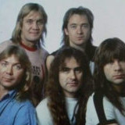

Британская хеви-метал группа, известная с 1980-х годов. Классический состав группы -  
вокал Брюс Дикинсон, гитары Дэйв Мюррей, Адриан Смит, Янис Герс, бас Стив Харрис, ударные Нико Макбрэйн.

* [2 Minutes To Midnight](2%20Minutes%20To%20Midnight.md)
* [22 Acacia Avenue](22%20Acacia%20Avenue.md)
* [Aces High](Aces%20High.md)
* [Afraid to Shoot Strangers](Afraid%20to%20Shoot%20Strangers.md)
* [Alexander The Great (2 вариант)](Alexander%20The%20Great%20(2%20вариант).md)
* [Alexander The Great (356-323 B.C.)](Alexander%20The%20Great%20(356-323%20B.C.).md)
* [Alexander the Great](Alexander%20the%20Great.md)
* [Back in the Village](Back%20in%20the%20Village.md)
* [Be Quick Or Be Dead](Be%20Quick%20Or%20Be%20Dead.md)
* [Blood Brothers](Blood%20Brothers.md)
* [Blood On The Worlds Hands](Blood%20On%20The%20Worlds%20Hands.md)
* [Bring Your Daughter...To The Slaughter](Bring%20Your%20Daughter...To%20The%20Slaughter.md)
* [Charlotte The Harlot](Charlotte%20The%20Harlot.md)
* [Children Of The Damned](Children%20Of%20The%20Damned.md)
* [Clairvoyant](Clairvoyant.md)
* [Como Estais Amigos](Como%20Estais%20Amigos.md)
* [Deja Vu](Deja%20Vu.md)
* [Fear Of The Dark (2 вариант)](Fear%20Of%20The%20Dark%20(2%20вариант).md)
* [Fear Of The Dark](Fear%20Of%20The%20Dark.md)
* [Flash of the Blade](Flash%20of%20the%20Blade.md)
* [Flight of Icarus](Flight%20of%20Icarus.md)
* [Fortunes Of War](Fortunes%20Of%20War.md)
* [From Here To Eternity](From%20Here%20To%20Eternity.md)
* [Genghis Kahn](Genghis%20Kahn.md)
* [Hallowed Be Thy Name](Hallowed%20Be%20Thy%20Name.md)
* [Holy Smoke](Holy%20Smoke.md)
* [Hooks in you](Hooks%20in%20you.md)
* [I've got the fire](I've%20got%20the%20fire.md)
* [Ides Of March](Ides%20Of%20March.md)
* [Infinite Dreams](Infinite%20Dreams.md)
* [Innocent Exile](Innocent%20Exile.md)
* [Invaders](Invaders.md)
* [Iron Maiden](Iron%20Maiden.md)
* [Killers Solo](Killers%20Solo.md)
* [Killers](Killers.md)
* [Look For The Truth](Look%20For%20The%20Truth.md)
* [Lord Of The Flies](Lord%20Of%20The%20Flies.md)
* [Losfer Words](Losfer%20Words.md)
* [Man On The Edge](Man%20On%20The%20Edge.md)
* [Moonchild](Moonchild.md)
* [Mother Russia](Mother%20Russia.md)
* [Murders In The Rue Morgue](Murders%20In%20The%20Rue%20Morgue.md)
* [My Generation](My%20Generation.md)
* [No Prayer For The Dying](No%20Prayer%20For%20The%20Dying.md)
* [Number Of The Beast](Number%20Of%20The%20Beast.md)
* [Phantom Of The Opera](Phantom%20Of%20The%20Opera.md)
* [Powerslave (2 вариант)](Powerslave%20(2%20вариант).md)
* [Powerslave](Powerslave.md)
* [Prodigal Son](Prodigal%20Son.md)
* [Quest For Fire](Quest%20For%20Fire.md)
* [Remember tomorrow](Remember%20tomorrow.md)
* [Revelations](Revelations.md)
* [Rhime of the Ancient Mariner](Rhime%20of%20the%20Ancient%20Mariner.md)
* [Rime Of The Ancient Mariner](Rime%20Of%20The%20Ancient%20Mariner.md)
* [Run To The Hills](Run%20To%20The%20Hills.md)
* [Run silent, run deep](Run%20silent,%20run%20deep.md)
* [Running Free](Running%20Free.md)
* [Seventh Son Of A Seventh Son](Seventh%20Son%20Of%20A%20Seventh%20Son.md)
* [Still Life](Still%20Life.md)
* [Strange World](Strange%20World.md)
* [Stranger in A Strange Land](Stranger%20in%20A%20Strange%20Land.md)
* [Sun And Steel](Sun%20And%20Steel.md)
* [Tailgunner](Tailgunner.md)
* [The Clairvoyant](The%20Clairvoyant.md)
* [The Evil That Men Do](The%20Evil%20That%20Men%20Do.md)
* [The Mercenary](The%20Mercenary.md)
* [The Number Of The Beast](The%20Number%20Of%20The%20Beast.md)
* [The Prisoner](The%20Prisoner.md)
* [The Sign Of The Cross](The%20Sign%20Of%20The%20Cross.md)
* [The Trooper (2 вариант)](The%20Trooper%20(2%20вариант).md)
* [The Trooper](The%20Trooper.md)
* [The Unbeliever](The%20Unbeliever.md)
* [The Wicker Man](The%20Wicker%20Man.md)
* [The edge of Darkness](The%20edge%20of%20Darkness.md)
* [To Tame A Land](To%20Tame%20A%20Land.md)
* [Total eclipse](Total%20eclipse.md)
* [Transilvania (2 вариант)](Transilvania%20(2%20вариант).md)
* [Transilvania](Transilvania.md)
* [Transylvania](Transylvania.md)
* [Twilight zone](Twilight%20zone.md)
* [Two Minutes To Midnight](Two%20Minutes%20To%20Midnight.md)
* [Virus](Virus.md)
* [Wasted Years](Wasted%20Years.md)
* [Wasting Love (2 вариант)](Wasting%20Love%20(2%20вариант).md)
* [Wasting Love](Wasting%20Love.md)
* [Weekend warrior](Weekend%20warrior.md)
* [Where Eagles Dare](Where%20Eagles%20Dare.md)
* [Wrathchild](Wrathchild.md)
* [Xfactor](Xfactor.md)