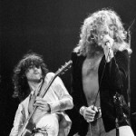

Британская рок-группа из Лондона, образованная в 1968 году вокалистом Робертом Плантом и гитаристом Джимми Пэйджем. Оказали значительное влияние на становление и развитие хард-рока. 

* [Achilles Last Stand Remasters](Achilles%20Last%20Stand%20Remasters.md)
* [Achilles' Last Stand](Achilles'%20Last%20Stand.md)
* [All My Love](All%20My%20Love.md)
* [Babe I'm Gonna Leave You (2 вариант)](Babe%20I'm%20Gonna%20Leave%20You%20(2%20вариант).md)
* [Babe I'm Gonna Leave You Remasters](Babe%20I'm%20Gonna%20Leave%20You%20Remasters.md)
* [Babe I'm gonna leave you](Babe%20I'm%20gonna%20leave%20you.md)
* [Battle Of Evermore (2 вариант)](Battle%20Of%20Evermore%20(2%20вариант).md)
* [Battle of Evermore](Battle%20of%20Evermore.md)
* [Black Country Womam](Black%20Country%20Womam.md)
* [Black Country Woman](Black%20Country%20Woman.md)
* [Black Dog (2 вариант)](Black%20Dog%20(2%20вариант).md)
* [Black Mountain' Side](Black%20Mountain'%20Side.md)
* [Black dog](Black%20dog.md)
* [Boogie With Stu](Boogie%20With%20Stu.md)
* [Bring It On Home (2 вариант)](Bring%20It%20On%20Home%20(2%20вариант).md)
* [Bring It On Home](Bring%20It%20On%20Home.md)
* [Bron Y Aur Stomp](Bron%20Y%20Aur%20Stomp.md)
* [Bron Yr Aur Stomp](Bron%20Yr%20Aur%20Stomp.md)
* [Bron Yr Aur](Bron%20Yr%20Aur.md)
* [Bron-Yr-Aur](Bron-Yr-Aur.md)
* [Carouselambra](Carouselambra.md)
* [Celebration Day Remasters](Celebration%20Day%20Remasters.md)
* [Celebration Day](Celebration%20Day.md)
* [Communication Breakdown (2 вариант)](Communication%20Breakdown%20(2%20вариант).md)
* [Communication Breakdown](Communication%20Breakdown.md)
* [Crungeo](Crungeo.md)
* [Custard Pie](Custard%20Pie.md)
* [D'yer Mak'er](D'yer%20Mak'er.md)
* [Dancing Days (2 вариант)](Dancing%20Days%20(2%20вариант).md)
* [Dancing Days](Dancing%20Days.md)
* [Dazed And Confused (2 вариант)](Dazed%20And%20Confused%20(2%20вариант).md)
* [Dazed And Confused](Dazed%20And%20Confused.md)
* [Down by the Seaside](Down%20by%20the%20Seaside.md)
* [Fool In The Rain (2 вариант)](Fool%20In%20The%20Rain%20(2%20вариант).md)
* [Fool in the Rain](Fool%20in%20the%20Rain.md)
* [For Your Life](For%20Your%20Life.md)
* [Four Sticks For 3 Guitars](Four%20Sticks%20For%203%20Guitars.md)
* [Four Sticks](Four%20Sticks.md)
* [Friends](Friends.md)
* [Gallows Pole](Gallows%20Pole.md)
* [Going To California (2 вариант)](Going%20To%20California%20(2%20вариант).md)
* [Going to California](Going%20to%20California.md)
* [Good Times Bad Times](Good%20Times%20Bad%20Times.md)
* [Heartbreaker (2 вариант)](Heartbreaker%20(2%20вариант).md)
* [Heartbreaker](Heartbreaker.md)
* [Hey Hey What Can I Do](Hey%20Hey%20What%20Can%20I%20Do.md)
* [Hot Dog](Hot%20Dog.md)
* [Hots On For Nowhere](Hots%20On%20For%20Nowhere.md)
* [Houses Of The Holy (2 вариант)](Houses%20Of%20The%20Holy%20(2%20вариант).md)
* [Houses Of The Holy](Houses%20Of%20The%20Holy.md)
* [How Many More Times (2 вариант)](How%20Many%20More%20Times%20(2%20вариант).md)
* [How Many More Times (3 вариант)](How%20Many%20More%20Times%20(3%20вариант).md)
* [How Many More Times](How%20Many%20More%20Times.md)
* [I Can't Quit You Baby](I%20Can't%20Quit%20You%20Baby.md)
* [I'm Gonna Crawl (2 вариант)](I'm%20Gonna%20Crawl%20(2%20вариант).md)
* [I'm Gonna Crawl](I'm%20Gonna%20Crawl.md)
* [Immigrant song](Immigrant%20song.md)
* [In My Time Of Dying (2 вариант)](In%20My%20Time%20Of%20Dying%20(2%20вариант).md)
* [In My Time Of Dying](In%20My%20Time%20Of%20Dying.md)
* [In The Light](In%20The%20Light.md)
* [Jennings Farm Blues](Jennings%20Farm%20Blues.md)
* [Kashmir (2 вариант)](Kashmir%20(2%20вариант).md)
* [Kashmir](Kashmir.md)
* [Living Loving Maid (2 вариант)](Living%20Loving%20Maid%20(2%20вариант).md)
* [Living Loving Maid](Living%20Loving%20Maid.md)
* [Misty Mountain' Hop (2 вариант)](Misty%20Mountain'%20Hop%20(2%20вариант).md)
* [Misty Mountain' Hop](Misty%20Mountain'%20Hop.md)
* [Moby Dick](Moby%20Dick.md)
* [Most High](Most%20High.md)
* [No Quarter](No%20Quarter.md)
* [Nobody's Fault But Mine](Nobody's%20Fault%20But%20Mine.md)
* [Out On The Tiles (2 вариант)](Out%20On%20The%20Tiles%20(2%20вариант).md)
* [Out On The Tiles](Out%20On%20The%20Tiles.md)
* [Over The Hills And Far Away (2 вариант)](Over%20The%20Hills%20And%20Far%20Away%20(2%20вариант).md)
* [Over The Hills And Far Away](Over%20The%20Hills%20And%20Far%20Away.md)
* [Poor Tom](Poor%20Tom.md)
* [Rain Song Intro](Rain%20Song%20Intro.md)
* [Ramble On](Ramble%20On.md)
* [Rock And Roll](Rock%20And%20Roll.md)
* [Rock N Roll](Rock%20N%20Roll.md)
* [Royal Orleans](Royal%20Orleans.md)
* [Sick Again](Sick%20Again.md)
* [Since I've been loving you](Since%20I've%20been%20loving%20you.md)
* [Song Remains The Same](Song%20Remains%20The%20Same.md)
* [Stairway to Heaven](Stairway%20to%20Heaven.md)
* [Stairway to heaven](Stairway%20to%20heaven.md)
* [Tangerine](Tangerine.md)
* [Tea For One](Tea%20For%20One.md)
* [Ten Years Gone](Ten%20Years%20Gone.md)
* [Thank you](Thank%20you.md)
* [That's the way](That's%20the%20way.md)
* [The Battle Of Evermore](The%20Battle%20Of%20Evermore.md)
* [The Crunge](The%20Crunge.md)
* [The Girl I Love She Got Long Black Wavy Hair](The%20Girl%20I%20Love%20She%20Got%20Long%20Black%20Wavy%20Hair.md)
* [The Girl I Love](The%20Girl%20I%20Love.md)
* [The Lemon Song](The%20Lemon%20Song.md)
* [The Ocean](The%20Ocean.md)
* [The Rain Song](The%20Rain%20Song.md)
* [The Rover](The%20Rover.md)
* [The Song Remains The Same (2 вариант)](The%20Song%20Remains%20The%20Same%20(2%20вариант).md)
* [The Song Remains The Same](The%20Song%20Remains%20The%20Same.md)
* [Trampled Underfoot](Trampled%20Underfoot.md)
* [Travelling Riverside Blues (2 вариант)](Travelling%20Riverside%20Blues%20(2%20вариант).md)
* [Travelling Riverside Blues](Travelling%20Riverside%20Blues.md)
* [Wah Wah Song](Wah%20Wah%20Song.md)
* [Walters Walk](Walters%20Walk.md)
* [Wanna Whole Lotta Love](Wanna%20Whole%20Lotta%20Love.md)
* [Wanton Song](Wanton%20Song.md)
* [What Is And What Should Never Be](What%20Is%20And%20What%20Should%20Never%20Be.md)
* [When the Levee Breaks](When%20the%20Levee%20Breaks.md)
* [White Summer](White%20Summer.md)
* [Whole Lotta Love (2 вариант)](Whole%20Lotta%20Love%20(2%20вариант).md)
* [Whole Lotta Love](Whole%20Lotta%20Love.md)
* [Yallah](Yallah.md)
* [You Shook Me](You%20Shook%20Me.md)
* [Your Time Is Gonna Come](Your%20Time%20Is%20Gonna%20Come.md)