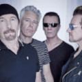

Популярная ирландская рок-группа, основанная в 1976 году.  
Рекордсмен по числу полученных премий *Грэмми* за всю историю.

* [40](40.md)
* [A Room At The Heartbreak Hotel](A%20Room%20At%20The%20Heartbreak%20Hotel.md)
* [Angel of Harlem](Angel%20of%20Harlem.md)
* [Desire](Desire.md)
* [Dirty Day](Dirty%20Day.md)
* [Discotheque](Discotheque.md)
* [Drowning Man](Drowning%20Man.md)
* [Hallelujah](Hallelujah.md)
* [If God Will Send His Angels](If%20God%20Will%20Send%20His%20Angels.md)
* [Love comes tumbling](Love%20comes%20tumbling.md)
* [Miss Sarajevo](Miss%20Sarajevo.md)
* [New Year's Day](New%20Year's%20Day.md)
* [One Tree Hill](One%20Tree%20Hill.md)
* [One](One.md)
* [Passengers](Passengers.md)
* [Stay (2 вариант)](Stay%20(2%20вариант).md)
* [Stay](Stay.md)
* [The First Time](The%20First%20Time.md)
* [The Ground Beneath Her Feet](The%20Ground%20Beneath%20Her%20Feet.md)
* [The Hands That Built America](The%20Hands%20That%20Built%20America.md)
* [Van Diemans Land](Van%20Diemans%20Land.md)
* [Van Diemens Land](Van%20Diemens%20Land.md)
* [Walk On](Walk%20On.md)
* [Who's Gonna Ride Your Wild Horses](Who's%20Gonna%20Ride%20Your%20Wild%20Horses.md)
* [With or Without You](With%20or%20Without%20You.md)
* [Zoo Station](Zoo%20Station.md)