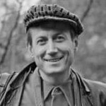

Советский и российский поэт, оратор, публицист. Номинант на Нобелевкую премию по литературе 1963 года.

* [Людей не много в этом мире](Людей%20не%20много%20в%20этом%20мире.md)
* [Людей неинтересных в мире нет](Людей%20неинтересных%20в%20мире%20нет.md)
* [Не надо бояться густого тумана](Не%20надо%20бояться%20густого%20тумана.md)