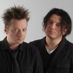

Популярная в 90-е годы российская рок-группа, основанная братьями Вадимом и Глебом Самойловами.

* [Ein Zwei Drei Waltz](Ein%20Zwei%20Drei%20Waltz.md)
* [Ein-Zwei-Drei-Waltz](Ein-Zwei-Drei-Waltz.md)
* [I love You](I%20love%20You.md)
* [Viva Kalman](Viva%20Kalman.md)
* [Viva Кальман](Viva%20Кальман.md)
* [Абордаж](Абордаж.md)
* [Айлавью](Айлавью.md)
* [Аллеpгия](Аллеpгия.md)
* [Аллергия](Аллергия.md)
* [Альрауне](Альрауне.md)
* [Аусвайс на небо](Аусвайс%20на%20небо.md)
* [Афpиканка](Афpиканка.md)
* [Африканка](Африканка.md)
* [Беглец](Беглец.md)
* [Ближе](Ближе.md)
* [Бэсса ме](Бэсса%20ме.md)
* [Бэсса мэ](Бэсса%20мэ.md)
* [В интересах революции](В%20интересах%20революции.md)
* [Веpвольф](Веpвольф.md)
* [Вервольф](Вервольф.md)
* [Веселый мир](Веселый%20мир.md)
* [Ветер](Ветер.md)
* [Вечная любовь](Вечная%20любовь.md)
* [Вольно](Вольно.md)
* [Второй фронт](Второй%20фронт.md)
* [Выпить море](Выпить%20море.md)
* [Гетеросексуалист](Гетеросексуалист.md)
* [Гитлер](Гитлер.md)
* [Глюки](Глюки.md)
* [Гномы-каннибалы](Гномы-каннибалы.md)
* [Грязь](Грязь.md)
* [Два корабля](Два%20корабля.md)
* [Дворник](Дворник.md)
* [Дезертир](Дезертир.md)
* [Декаданс](Декаданс.md)
* [Детка-конфетка](Детка-конфетка.md)
* [Джиги Дзаги](Джиги%20Дзаги.md)
* [Джиги-Дзаги](Джиги-Дзаги.md)
* [Днем и ночью](Днем%20и%20ночью.md)
* [Доpога паука](Доpога%20паука.md)
* [Дорога Паука](Дорога%20Паука.md)
* [Его там не было](Его%20там%20не%20было.md)
* [Звездное гестапо](Звездное%20гестапо.md)
* [Звездочет](Звездочет.md)
* [Извращение](Извращение.md)
* [Инспектоp По...](Инспектоp%20По....md)
* [Инспектор по...](Инспектор%20по....md)
* [Искушение Маленького Фрица](Искушение%20Маленького%20Фрица.md)
* [Истерика](Истерика.md)
* [Как на войне](Как%20на%20войне.md)
* [Канкан](Канкан.md)
* [Ковер-вертолет](Ковер-вертолет.md)
* [Командир](Командир.md)
* [Коммунальный блюз](Коммунальный%20блюз.md)
* [Кондуктор](Кондуктор.md)
* [Корвет уходит в небеса](Корвет%20уходит%20в%20небеса.md)
* [Кошка](Кошка.md)
* [Красная Шапочка](Красная%20Шапочка.md)
* [Красный петух](Красный%20петух.md)
* [Крошка](Крошка.md)
* [Кто украл мою звезду](Кто%20украл%20мою%20звезду.md)
* [Легион](Легион.md)
* [Любовь идет на дело](Любовь%20идет%20на%20дело.md)
* [Месяц](Месяц.md)
* [Молитва](Молитва.md)
* [Моряк](Моряк.md)
* [Мотоциклетка](Мотоциклетка.md)
* [На войне](На%20войне.md)
* [На дне](На%20дне.md)
* [На краю у неба](На%20краю%20у%20неба.md)
* [Навеселе](Навеселе.md)
* [Насилие](Насилие.md)
* [Наша семья](Наша%20семья.md)
* [Неживая вода](Неживая%20вода.md)
* [Немного земли](Немного%20земли.md)
* [Ни там ни тут](Ни%20там%20ни%20тут.md)
* [Никогда](Никогда.md)
* [Нисхождение](Нисхождение.md)
* [Новый Год](Новый%20Год.md)
* [Огоньки](Огоньки.md)
* [Они летят](Они%20летят.md)
* [Опиум для никого](Опиум%20для%20никого.md)
* [Пантеpа](Пантеpа.md)
* [Пантера](Пантера.md)
* [Партизаны](Партизаны.md)
* [Пиpат](Пиpат.md)
* [Пинкертон](Пинкертон.md)
* [Пират](Пират.md)
* [Позови меня, небо](Позови%20меня,%20небо.md)
* [Позорная звезда](Позорная%20звезда.md)
* [Пока-пока](Пока-пока.md)
* [Покрышкин](Покрышкин.md)
* [Полетаем](Полетаем.md)
* [Ползёт](Ползёт.md)
* [Последний подвиг Евы Браун](Последний%20подвиг%20Евы%20Браун.md)
* [Поход](Поход.md)
* [Праздник семьи](Праздник%20семьи.md)
* [Пролог. Убитая любовь.](Пролог.%20Убитая%20любовь..md)
* [Пролог. Убитая любовь](Пролог.%20Убитая%20любовь.md)
* [Пулемет Максим](Пулемет%20Максим.md)
* [Пулемёт Максим](Пулемёт%20Максим.md)
* [Пуля](Пуля.md)
* [Розовый бинт](Розовый%20бинт.md)
* [Садо-мазо](Садо-мазо.md)
* [Секрет](Секрет.md)
* [Серое небо](Серое%20небо.md)
* [Серый траур](Серый%20траур.md)
* [Сирота](Сирота.md)
* [Сказочная тайга](Сказочная%20тайга.md)
* [Снайпер](Снайпер.md)
* [Сны](Сны.md)
* [Со щитом иль на щите](Со%20щитом%20иль%20на%20щите.md)
* [Собачье сердце](Собачье%20сердце.md)
* [Споем о сексе](Споем%20о%20сексе.md)
* [Споемте о сексе](Споемте%20о%20сексе.md)
* [Странное рождество](Странное%20рождество.md)
* [Сытая свинья](Сытая%20свинья.md)
* [Танго с дельтапланом](Танго%20с%20дельтапланом.md)
* [Телесудьбы](Телесудьбы.md)
* [Тоска без конца](Тоска%20без%20конца.md)
* [Трансильвания](Трансильвания.md)
* [Триллер](Триллер.md)
* [Ты и я](Ты%20и%20я.md)
* [Ты уходишь](Ты%20уходишь.md)
* [Убитая любовь](Убитая%20любовь.md)
* [Ураган](Ураган.md)
* [Фрау его мечты](Фрау%20его%20мечты.md)
* [ХалиГалиКришна](ХалиГалиКришна.md)
* [Холодная любовь](Холодная%20любовь.md)
* [Черная луна](Черная%20луна.md)
* [Черные волки](Черные%20волки.md)
* [Четыре слова](Четыре%20слова.md)
* [Чудеса](Чудеса.md)
* [Чёрная луна](Чёрная%20луна.md)
* [Шпала](Шпала.md)
* [Щекотно](Щекотно.md)
* [Эксперимент](Эксперимент.md)
* [Эпидемия](Эпидемия.md)
* [Эпилог. На краю](Эпилог.%20На%20краю.md)
* [Я буду там](Я%20буду%20там.md)
* [Я вернусь](Я%20вернусь.md)
* [Я на тебе, как на войне](Я%20на%20тебе,%20как%20на%20войне.md)
* [Я убегаю](Я%20убегаю.md)