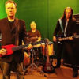

Советская музыкальная группа, образованная в Москве в конце *1970*-х годов.
Бессменный лидер группы — *Василий Шумов*. 
Стиль группы менялся от рока до электроники.

* [Володя потусторонний шофер](Володя%20потусторонний%20шофер.md)
* [Горизонтальные люди](Горизонтальные%20люди.md)
* [Мальчик в тенисных туфлях](Мальчик%20в%20тенисных%20туфлях.md)
* [Привет тебе](Привет%20тебе.md)
* [Смутное пятно неизвестно чего](Смутное%20пятно%20неизвестно%20чего.md)
* [Я все умею](Я%20все%20умею.md)