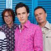

Советская и российская поп-рок группа из Москвы, образованная в 1983 гитаристом и композитором Евгением Хавтаном.

* [20-й век](20-й%20век.md)
* [2х2=4](2х2=4.md)
* [7 тысяч над землей](7%20тысяч%20над%20землей.md)
* [Автомобиль](Автомобиль.md)
* [Ах, эта девчонка... (2 вариант)](Ах,%20эта%20девчонка...%20(2%20вариант).md)
* [Ах, эта девчонка... (3 вариант)](Ах,%20эта%20девчонка...%20(3%20вариант).md)
* [Ах, эта девчонка...](Ах,%20эта%20девчонка....md)
* [Аэроплан](Аэроплан.md)
* [Блюз голубой луны](Блюз%20голубой%20луны.md)
* [Буги-автостоп](Буги-автостоп.md)
* [Будь со мной](Будь%20со%20мной.md)
* [В логичном мире](В%20логичном%20мире.md)
* [В пятницу вечером](В%20пятницу%20вечером.md)
* [В чем дело](В%20чем%20дело.md)
* [Вася](Вася.md)
* [Вера, Наджеда, Любовь](Вера,%20Наджеда,%20Любовь.md)
* [Верю я](Верю%20я.md)
* [Ветер знает](Ветер%20знает.md)
* [Вот и все (2 вариант)](Вот%20и%20все%20(2%20вариант).md)
* [Вот и все](Вот%20и%20все.md)
* [Вот и всё](Вот%20и%20всё.md)
* [Выше всех](Выше%20всех.md)
* [Гангстер любви](Гангстер%20любви.md)
* [Девочка](Девочка.md)
* [Девчонка 16-ти лет](Девчонка%2016-ти%20лет.md)
* [Держись, пижон](Держись,%20пижон.md)
* [Джамайка (Giamaica)](Джамайка%20(Giamaica).md)
* [До свидания](До%20свидания.md)
* [Добрый вечер, Москва](Добрый%20вечер,%20Москва.md)
* [Дождь и ладонь](Дождь%20и%20ладонь.md)
* [Доктор ночь](Доктор%20ночь.md)
* [Дорога в облака (2 вариант)](Дорога%20в%20облака%20(2%20вариант).md)
* [Дорога в облака (3 вариант)](Дорога%20в%20облака%20(3%20вариант).md)
* [Дорога в облака](Дорога%20в%20облака.md)
* [Если бы на Марсе](Если%20бы%20на%20Марсе.md)
* [Жар-птица (2 вариант)](Жар-птица%20(2%20вариант).md)
* [Жар-птица](Жар-птица.md)
* [Желтые ботинки](Желтые%20ботинки.md)
* [Замок из песка](Замок%20из%20песка.md)
* [Заполярный твист](Заполярный%20твист.md)
* [Зачем родился ты](Зачем%20родился%20ты.md)
* [Звездный каталог](Звездный%20каталог.md)
* [Звёздный шейк](Звёздный%20шейк.md)
* [Как быть](Как%20быть.md)
* [Как жаль, что ты сегодня не со мной](Как%20жаль,%20что%20ты%20сегодня%20не%20со%20мной.md)
* [Как жаль](Как%20жаль.md)
* [Клоун](Клоун.md)
* [Ключ на старт](Ключ%20на%20старт.md)
* [Король Оранжевое Лето](Король%20Оранжевое%20Лето.md)
* [Король курорта](Король%20курорта.md)
* [Космический рок-н-ролл](Космический%20рок-н-ролл.md)
* [Кошки](Кошки.md)
* [Красная стрела](Красная%20стрела.md)
* [Красный свет](Красный%20свет.md)
* [Крепко спит город](Крепко%20спит%20город.md)
* [Кто знает](Кто%20знает.md)
* [Ленинградский рок-н-ролл](Ленинградский%20рок-н-ролл.md)
* [Лунатик](Лунатик.md)
* [Лучший город Земли](Лучший%20город%20Земли.md)
* [Любите, девушки... (2 вариант)](Любите,%20девушки...%20(2%20вариант).md)
* [Любите, девушки... (3 вариант)](Любите,%20девушки...%20(3%20вариант).md)
* [Любите, девушки... (4 вариант)](Любите,%20девушки...%20(4%20вариант).md)
* [Любите, девушки...](Любите,%20девушки....md)
* [Любовь не горит](Любовь%20не%20горит.md)
* [Маленький помощник весны](Маленький%20помощник%20весны.md)
* [Марсианка](Марсианка.md)
* [Мауна Лоа](Мауна%20Лоа.md)
* [Медицинский институт](Медицинский%20институт.md)
* [Мне грустно и легко](Мне%20грустно%20и%20легко.md)
* [Молодость](Молодость.md)
* [Московский бит](Московский%20бит.md)
* [На планете Гамма](На%20планете%20Гамма.md)
* [На шелковом парашюте](На%20шелковом%20парашюте.md)
* [Надо спешить туда](Надо%20спешить%20туда.md)
* [Наташа](Наташа.md)
* [Не с тобой](Не%20с%20тобой.md)
* [Небо](Небо.md)
* [Незнакомка](Незнакомка.md)
* [Неспящие](Неспящие.md)
* [Новый герой](Новый%20герой.md)
* [Ночной Экспресс](Ночной%20Экспресс.md)
* [О любви моей](О%20любви%20моей.md)
* [Однажды](Однажды.md)
* [Оранжевый галстук](Оранжевый%20галстук.md)
* [Останься ещё на час](Останься%20ещё%20на%20час.md)
* [Открытие](Открытие.md)
* [Парень в лиловом Сомбреро](Парень%20в%20лиловом%20Сомбреро.md)
* [Перо Жар-птицы](Перо%20Жар-птицы.md)
* [Песня облаков](Песня%20облаков.md)
* [Пижон](Пижон.md)
* [Пилот 12-45](Пилот%2012-45.md)
* [По волнам](По%20волнам.md)
* [Под куполом звёзд](Под%20куполом%20звёзд.md)
* [Полет](Полет.md)
* [Просто так](Просто%20так.md)
* [Пусть не кончается дождь](Пусть%20не%20кончается%20дождь.md)
* [Рио](Рио.md)
* [Розы](Розы.md)
* [С днём рождения](С%20днём%20рождения.md)
* [Север и Юг](Север%20и%20Юг.md)
* [Северный полюс](Северный%20полюс.md)
* [Серенада 2000](Серенада%202000.md)
* [Синеглазый мальчик](Синеглазый%20мальчик.md)
* [Синее, синее небо (2 вариант)](Синее,%20синее%20небо%20(2%20вариант).md)
* [Синее, синее небо](Синее,%20синее%20небо.md)
* [Скорый поезд](Скорый%20поезд.md)
* [Сны](Сны.md)
* [Сон-обман](Сон-обман.md)
* [Старый отель](Старый%20отель.md)
* [Стильный оранжевый галстук](Стильный%20оранжевый%20галстук.md)
* [Страна цветов](Страна%20цветов.md)
* [Стрижи](Стрижи.md)
* [Там, где сбываются сны](Там,%20где%20сбываются%20сны.md)
* [Там, так далеко](Там,%20так%20далеко.md)
* [Тише, послушай](Тише,%20послушай.md)
* [Тот, кто верит](Тот,%20кто%20верит.md)
* [Ты, с высоты...](Ты,%20с%20высоты....md)
* [Хмурые серые тучи](Хмурые%20серые%20тучи.md)
* [Черный кот (2 вариант)](Черный%20кот%20(2%20вариант).md)
* [Черный кот](Черный%20кот.md)
* [Чудесная страна](Чудесная%20страна.md)
* [Это за окном рассвет](Это%20за%20окном%20рассвет.md)
* [Этот город](Этот%20город.md)
* [Я вернусь](Я%20вернусь.md)
* [Я то, что надо](Я%20то,%20что%20надо.md)
* [Я хотел бы ветpом быть 2](Я%20хотел%20бы%20ветpом%20быть%202.md)