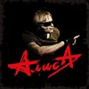

Одна из старейших российских и советских рок-групп. Основана в Ленинграде в 1983 году. Лидер группы Константин Кинчев.

* [Rock-n-Roll - это не работа](Rock-n-Roll%20-%20это%20не%20работа.md)
* [Rock-n-Roll](Rock-n-Roll.md)
* [Rock-n-roll крест](Rock-n-roll%20крест.md)
* [А мы танцуем на палубе тонущего корабля](А%20мы%20танцуем%20на%20палубе%20тонущего%20корабля.md)
* [Аккумулятор](Аккумулятор.md)
* [Акселерация](Акселерация.md)
* [Антиромантика](Антиромантика.md)
* [Антихрист](Антихрист.md)
* [Армия жизни](Армия%20жизни.md)
* [Атеист](Атеист.md)
* [Аэробика (2 вариант)](Аэробика%20(2%20вариант).md)
* [Аэробика](Аэробика.md)
* [Без креста](Без%20креста.md)
* [Белая невеста (2 вариант)](Белая%20невеста%20(2%20вариант).md)
* [Белая невеста](Белая%20невеста.md)
* [Бес паники](Бес%20паники.md)
* [Блондинка](Блондинка.md)
* [Бойся, проси и верь](Бойся,%20проси%20и%20верь.md)
* [Большое ружьё](Большое%20ружьё.md)
* [Бродячий цирк](Бродячий%20цирк.md)
* [Веретено](Веретено.md)
* [Ветер водит хоровод](Ветер%20водит%20хоровод.md)
* [Ветер перемен](Ветер%20перемен.md)
* [Ветер](Ветер.md)
* [Вечер](Вечер.md)
* [Вечный шут](Вечный%20шут.md)
* [Воздух](Воздух.md)
* [Война](Война.md)
* [Волна (2 вариант)](Волна%20(2%20вариант).md)
* [Волна](Волна.md)
* [Вор да палач (2 вариант)](Вор%20да%20палач%20(2%20вариант).md)
* [Вор да палач](Вор%20да%20палач.md)
* [Вот так (2 вариант)](Вот%20так%20(2%20вариант).md)
* [Вот так](Вот%20так.md)
* [Время менять имена](Время%20менять%20имена.md)
* [Всадник](Всадник.md)
* [Все в наших руках](Все%20в%20наших%20руках.md)
* [Все решено (2 вариант)](Все%20решено%20(2%20вариант).md)
* [Все решено](Все%20решено.md)
* [Все это рок-н-ролл](Все%20это%20рок-н-ролл.md)
* [Всё это Rock'n'Roll](Всё%20это%20Rock'n'Roll.md)
* [Где твой билет](Где%20твой%20билет.md)
* [Голубой банщик](Голубой%20банщик.md)
* [Горизонт (2 вариант)](Горизонт%20(2%20вариант).md)
* [Горизонт](Горизонт.md)
* [Город](Город.md)
* [Гость](Гость.md)
* [Готовы ли мы отвечать](Готовы%20ли%20мы%20отвечать.md)
* [Грязь](Грязь.md)
* [Гуталиновый ангел](Гуталиновый%20ангел.md)
* [Движение вспять](Движение%20вспять.md)
* [День открытых дверей](День%20открытых%20дверей.md)
* [Для тех, кто свалился с луны](Для%20тех,%20кто%20свалился%20с%20луны.md)
* [Доброе утро](Доброе%20утро.md)
* [Дождь](Дождь.md)
* [Доктор Буги (2 вариант)](Доктор%20Буги%20(2%20вариант).md)
* [Доктор Буги](Доктор%20Буги.md)
* [Доктор Франкенштейн](Доктор%20Франкенштейн.md)
* [Дорога в небо](Дорога%20в%20небо.md)
* [Дружеское напутствие альпинисту](Дружеское%20напутствие%20альпинисту.md)
* [Дудочник](Дудочник.md)
* [Дурак (2 вариант)](Дурак%20(2%20вариант).md)
* [Дурак и Солнце](Дурак%20и%20Солнце.md)
* [Дурак](Дурак.md)
* [Душа](Душа.md)
* [Дым](Дым.md)
* [Дятел](Дятел.md)
* [Жар Бог Шуга](Жар%20Бог%20Шуга.md)
* [Жар бог Шуга (2 вариант)](Жар%20бог%20Шуга%20(2%20вариант).md)
* [Жги-гуляй (2 вариант)](Жги-гуляй%20(2%20вариант).md)
* [Жги-гуляй](Жги-гуляй.md)
* [Жизнь струны](Жизнь%20струны.md)
* [Завтра может быть поздно (2 вариант)](Завтра%20может%20быть%20поздно%20(2%20вариант).md)
* [Завтра может быть поздно](Завтра%20может%20быть%20поздно.md)
* [Званые](Званые.md)
* [Звезда по имени Рок](Звезда%20по%20имени%20Рок.md)
* [Звезда свиней](Звезда%20свиней.md)
* [Звери](Звери.md)
* [Земля](Земля.md)
* [Знак](Знак.md)
* [Знаки (Осень)](Знаки%20(Осень).md)
* [Иго Любви](Иго%20Любви.md)
* [Изгой](Изгой.md)
* [Инвалид рока](Инвалид%20рока.md)
* [Инок, воин и шут](Инок,%20воин%20и%20шут.md)
* [Каждую ночь](Каждую%20ночь.md)
* [Камикадзе](Камикадзе.md)
* [Камнепад](Камнепад.md)
* [Карантин](Карантин.md)
* [Картонный дом (2 вариант)](Картонный%20дом%20(2%20вариант).md)
* [Картонный дом](Картонный%20дом.md)
* [Кибитка](Кибитка.md)
* [Ко мне (2 вариант)](Ко%20мне%20(2%20вариант).md)
* [Ко мне (3 вариант)](Ко%20мне%20(3%20вариант).md)
* [Ко мне](Ко%20мне.md)
* [Кода](Кода.md)
* [Колыбельная](Колыбельная.md)
* [Компромисс](Компромисс.md)
* [Кошке хочется спать](Кошке%20хочется%20спать.md)
* [Красная книга](Красная%20книга.md)
* [Красное на черном (2 вариант)](Красное%20на%20черном%20(2%20вариант).md)
* [Красное на черном (3 вариант)](Красное%20на%20черном%20(3%20вариант).md)
* [Красное на черном](Красное%20на%20черном.md)
* [Красное на чёрном](Красное%20на%20чёрном.md)
* [Красные Горы](Красные%20Горы.md)
* [Красные горы (2 вариант)](Красные%20горы%20(2%20вариант).md)
* [Крещение](Крещение.md)
* [Кривозеркалье](Кривозеркалье.md)
* [Кто ты](Кто%20ты.md)
* [Купи танк](Купи%20танк.md)
* [Лень](Лень.md)
* [Лодка (2 вариант)](Лодка%20(2%20вариант).md)
* [Лодка (3 вариант)](Лодка%20(3%20вариант).md)
* [Лодка (Весла)](Лодка%20(Весла).md)
* [Лодка](Лодка.md)
* [Лунный вальс](Лунный%20вальс.md)
* [Любовь](Любовь.md)
* [Маленький театр (Лунный вальс)](Маленький%20театр%20(Лунный%20вальс).md)
* [Маленький театр (Лунный вальс2)](Маленький%20театр%20(Лунный%20вальс2).md)
* [Мама](Мама.md)
* [Манекен](Манекен.md)
* [Меломан](Меломан.md)
* [Металл](Металл.md)
* [Минус-плюс](Минус-плюс.md)
* [Мое поколение (2 вариант)](Мое%20поколение%20(2%20вариант).md)
* [Мое поколение](Мое%20поколение.md)
* [Мой Город](Мой%20Город.md)
* [Мой театр (2 вариант)](Мой%20театр%20(2%20вариант).md)
* [Мой театр](Мой%20театр.md)
* [Моя война](Моя%20война.md)
* [Мужчина - машина, женщина - лёд](Мужчина%20-%20машина,%20женщина%20-%20лёд.md)
* [Мы вместе (2вариант)](Мы%20вместе%20(2вариант).md)
* [Мы вместе (3 вариант)](Мы%20вместе%20(3%20вариант).md)
* [Мы вместе](Мы%20вместе.md)
* [Мы держим путь в сторону леса](Мы%20держим%20путь%20в%20сторону%20леса.md)
* [Мышиный цирк](Мышиный%20цирк.md)
* [На пороге неба](На%20пороге%20неба.md)
* [Нахал](Нахал.md)
* [Небо Славян](Небо%20Славян.md)
* [Небо славян (2 вариант)](Небо%20славян%20(2%20вариант).md)
* [Непокорные](Непокорные.md)
* [Нет войне (2 вариант)](Нет%20войне%20(2%20вариант).md)
* [Нет войне](Нет%20войне.md)
* [Новая кровь (2 вариант)](Новая%20кровь%20(2%20вариант).md)
* [Новая кровь](Новая%20кровь.md)
* [Новый метод](Новый%20метод.md)
* [Ночные окна](Ночные%20окна.md)
* [Ночь](Ночь.md)
* [Одноразовая любовь](Одноразовая%20любовь.md)
* [Ой я тебя люблю Алла](Ой%20я%20тебя%20люблю%20Алла.md)
* [Ой, я люблю тебя, Алла](Ой,%20я%20люблю%20тебя,%20Алла.md)
* [Осеннее солнце](Осеннее%20солнце.md)
* [Падал снег](Падал%20снег.md)
* [Папа Тани](Папа%20Тани.md)
* [Папуас Рэп](Папуас%20Рэп.md)
* [Паруса звездолова](Паруса%20звездолова.md)
* [Паскуда (2 вариант)](Паскуда%20(2%20вариант).md)
* [Паскуда](Паскуда.md)
* [Пасынок звезд (2 вариант)](Пасынок%20звезд%20(2%20вариант).md)
* [Пасынок звезд](Пасынок%20звезд.md)
* [Перекресток (2 вариант)](Перекресток%20(2%20вариант).md)
* [Перекресток](Перекресток.md)
* [Перекрёсток](Перекрёсток.md)
* [Песня без слов](Песня%20без%20слов.md)
* [Печаль](Печаль.md)
* [Печать зверя](Печать%20зверя.md)
* [Плач](Плач.md)
* [Плод](Плод.md)
* [Плохой рок-н-ролл](Плохой%20рок-н-ролл.md)
* [Плюс-минус](Плюс-минус.md)
* [Пляж (2 вариант)](Пляж%20(2%20вариант).md)
* [Пляж](Пляж.md)
* [Пляс Сибири (2 вариант)](Пляс%20Сибири%20(2%20вариант).md)
* [Пляс Сибири](Пляс%20Сибири.md)
* [По Барабану](По%20Барабану.md)
* [По лабиринтам](По%20лабиринтам.md)
* [Повелитель Блох](Повелитель%20Блох.md)
* [Повелитель блох (2 вариант)](Повелитель%20блох%20(2%20вариант).md)
* [Поезд](Поезд.md)
* [Поколение Х](Поколение%20Х.md)
* [Поллюционный сон](Поллюционный%20сон.md)
* [Понедельник](Понедельник.md)
* [Посторонний](Посторонний.md)
* [Православные](Православные.md)
* [Прозаик](Прозаик.md)
* [Птица Марабу](Птица%20Марабу.md)
* [Путь в сторону леса](Путь%20в%20сторону%20леса.md)
* [Радости печаль](Радости%20печаль.md)
* [Республика](Республика.md)
* [Родина](Родина.md)
* [Рождество](Рождество.md)
* [Рок-н-ролл крест](Рок-н-ролл%20крест.md)
* [Самогон рок](Самогон%20рок.md)
* [Света](Света.md)
* [Северная Быль](Северная%20Быль.md)
* [Сильные идут вперёд](Сильные%20идут%20вперёд.md)
* [Синий дым](Синий%20дым.md)
* [Синий предел](Синий%20предел.md)
* [Синтезатор сладострастия](Синтезатор%20сладострастия.md)
* [Скоро зима](Скоро%20зима.md)
* [Слезы звезд](Слезы%20звезд.md)
* [Слово](Слово.md)
* [Смерть](Смерть.md)
* [Смутные дни](Смутные%20дни.md)
* [Снег](Снег.md)
* [Снова в Америке](Снова%20в%20Америке.md)
* [Соковыжиматель](Соковыжиматель.md)
* [Солнце встает](Солнце%20встает.md)
* [Солнце за нас](Солнце%20за%20нас.md)
* [Солнце-Иерусалим](Солнце-Иерусалим.md)
* [Солнцеворот](Солнцеворот.md)
* [Спокойная Ночь](Спокойная%20Ночь.md)
* [Старые раны](Старые%20раны.md)
* [Стать Севера](Стать%20Севера.md)
* [Стерх (2 вариант)](Стерх%20(2%20вариант).md)
* [Стерх](Стерх.md)
* [Странная игра](Странная%20игра.md)
* [Суд (2 вариант)](Суд%20(2%20вариант).md)
* [Суд (3 вариант)](Суд%20(3%20вариант).md)
* [Суд](Суд.md)
* [Сумасшедший дом](Сумасшедший%20дом.md)
* [Сумасшедший твист](Сумасшедший%20твист.md)
* [Сумерки (2 вариант)](Сумерки%20(2%20вариант).md)
* [Сумерки](Сумерки.md)
* [Такие дела, хозяин](Такие%20дела,%20хозяин.md)
* [Такие дела](Такие%20дела.md)
* [Танец на палубе тонущего корабля (2 вариант)](Танец%20на%20палубе%20тонущего%20корабля%20(2%20вариант).md)
* [Танец на палубе тонущего корабля](Танец%20на%20палубе%20тонущего%20корабля.md)
* [Танцевать](Танцевать.md)
* [Театр теней](Театр%20теней.md)
* [Театр](Театр.md)
* [Тигалагалоба (Брэкдэнсгопак)](Тигалагалоба%20(Брэкдэнсгопак).md)
* [То ли про любовь, то ли про беду](То%20ли%20про%20любовь,%20то%20ли%20про%20беду.md)
* [Только этот день (2 вариант)](Только%20этот%20день%20(2%20вариант).md)
* [Только этот день](Только%20этот%20день.md)
* [Тоталитарный рэп](Тоталитарный%20рэп.md)
* [Трасса Е-95 (2 вариант)](Трасса%20Е-95%20(2%20вариант).md)
* [Трасса Е-95](Трасса%20Е-95.md)
* [Три Дороги](Три%20Дороги.md)
* [Три дороги (2 вариант)](Три%20дороги%20(2%20вариант).md)
* [Тыр, тыр, тыр](Тыр,%20тыр,%20тыр.md)
* [Тыр-тыр-тыр (2 вариант)](Тыр-тыр-тыр%20(2%20вариант).md)
* [Тыр-тыр-тыр](Тыр-тыр-тыр.md)
* [У истока голубой реки](У%20истока%20голубой%20реки.md)
* [У истоков голубой реки](У%20истоков%20голубой%20реки.md)
* [Умереть молодым](Умереть%20молодым.md)
* [Формула власти (Бойся, проси и верь)](Формула%20власти%20(Бойся,%20проси%20и%20верь).md)
* [Хозяин](Хозяин.md)
* [Черная Rock'N'Roll мама](Черная%20Rock'N'Roll%20мама.md)
* [Черная метка](Черная%20метка.md)
* [Черная рок-н-ролл мама (2 вариант)](Черная%20рок-н-ролл%20мама%20(2%20вариант).md)
* [Черная рок-н-ролл мама (3 вариант)](Черная%20рок-н-ролл%20мама%20(3%20вариант).md)
* [Черная рок-н-ролл мама](Черная%20рок-н-ролл%20мама.md)
* [Черта (2 вариант)](Черта%20(2%20вариант).md)
* [Черта](Черта.md)
* [Чик-чик-чик](Чик-чик-чик.md)
* [Чунга-чанга (2 вариант)](Чунга-чанга%20(2%20вариант).md)
* [Чунга-чанга](Чунга-чанга.md)
* [Чую гибель](Чую%20гибель.md)
* [Чёрная метка](Чёрная%20метка.md)
* [Чёрный](Чёрный.md)
* [Шабаш 2](Шабаш%202.md)
* [Шабаш-2](Шабаш-2.md)
* [Шабаш](Шабаш.md)
* [Шанс](Шанс.md)
* [Шестой лесничий](Шестой%20лесничий.md)
* [Шпиономания](Шпиономания.md)
* [Эй, ты, там, на том берегу](Эй,%20ты,%20там,%20на%20том%20берегу.md)
* [Экспериментатор (2 вариант)](Экспериментатор%20(2%20вариант).md)
* [Экспериментатор](Экспериментатор.md)
* [Энергия](Энергия.md)
* [Я вижу то, что вижу (Красная книга)](Я%20вижу%20то,%20что%20вижу%20(Красная%20книга).md)
* [Я вижу то, что вижу](Я%20вижу%20то,%20что%20вижу.md)
* [Я дышал синевой...](Я%20дышал%20синевой....md)
* [Я играю в войну](Я%20играю%20в%20войну.md)
* [Ямщик](Ямщик.md)