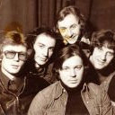

Московская рок-группа, образовавшаяся в конце 1960-х годов. В разное время с группой сотрудничали композиторы Геннадий Гладков, Алексей Рыбников, Юрий Антонов, музыканты Алексей Романов, Константин Никольский.

* [Странная ночь (2)](Странная%20ночь%20(2).md)
* [Странная ночь (3)](Странная%20ночь%20(3).md)
* [Странная ночь](Странная%20ночь.md)