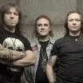

Советская и российская рок-группа, играющая в жанре хеви-метал. 
Одна из старейших и самых успешных русских рок-групп, 
при этом это одна из немногих российских групп, 
достигших серьёзного коммерческого и творческого успехов и 
популярности за пределами поклонников хэви-метала. 

* [1100 (2 вариант)](1100%20(2%20вариант).md)
* [1100](1100.md)
* [Castlevania (2 вариант)](Castlevania%20(2%20вариант).md)
* [Castlevania](Castlevania.md)
* [You'd Better Believe Me](You'd%20Better%20Believe%20Me.md)
* [Ангельская пыль (2 вариант)](Ангельская%20пыль%20(2%20вариант).md)
* [Ангельская пыль (3 вариант)](Ангельская%20пыль%20(3%20вариант).md)
* [Ангельская пыль (4 вариант)](Ангельская%20пыль%20(4%20вариант).md)
* [Ангельская пыль](Ангельская%20пыль.md)
* [Антихрист](Антихрист.md)
* [Бал у Князя Тьмы (2 вариант)](Бал%20у%20Князя%20Тьмы%20(2%20вариант).md)
* [Бал у Князя Тьмы](Бал%20у%20Князя%20Тьмы.md)
* [Баллада о древнерусском воине (2 вариант)](Баллада%20о%20древнерусском%20воине%20(2%20вариант).md)
* [Баллада о древнерусском воине (3 вариант)](Баллада%20о%20древнерусском%20воине%20(3%20вариант).md)
* [Баллада о древнерусском воине (4 вариант)](Баллада%20о%20древнерусском%20воине%20(4%20вариант).md)
* [Баллада о древнерусском воине](Баллада%20о%20древнерусском%20воине.md)
* [Беги за солнцем](Беги%20за%20солнцем.md)
* [Без тебя (2 вариант)](Без%20тебя%20(2%20вариант).md)
* [Без тебя (3 вариант)](Без%20тебя%20(3%20вариант).md)
* [Без тебя](Без%20тебя.md)
* [Белый флаг (2 вариант)](Белый%20флаг%20(2%20вариант).md)
* [Белый флаг](Белый%20флаг.md)
* [Беспечный ангел (2 вариант)](Беспечный%20ангел%20(2%20вариант).md)
* [Беспечный ангел (3 вариант)](Беспечный%20ангел%20(3%20вариант).md)
* [Беспечный ангел (4 вариант)](Беспечный%20ангел%20(4%20вариант).md)
* [Беспечный ангел](Беспечный%20ангел.md)
* [Бесы (2 вариант)](Бесы%20(2%20вариант).md)
* [Бесы](Бесы.md)
* [Бивни черных скал](Бивни%20черных%20скал.md)
* [Битва](Битва.md)
* [Блики Солнца на воде](Блики%20Солнца%20на%20воде.md)
* [Бой продолжается](Бой%20продолжается.md)
* [Будем жить мать Россия](Будем%20жить%20мать%20Россия.md)
* [Будем жить, мать Россия (2 вариант)](Будем%20жить,%20мать%20Россия%20(2%20вариант).md)
* [Будем жить, мать Россия](Будем%20жить,%20мать%20Россия.md)
* [Вавилон](Вавилон.md)
* [Вампир (2 вариант)](Вампир%20(2%20вариант).md)
* [Вампир (3 вариант)](Вампир%20(3%20вариант).md)
* [Вампир](Вампир.md)
* [Викинг](Викинг.md)
* [Возьми мое сердце (2 вариант)](Возьми%20мое%20сердце%20(2%20вариант).md)
* [Возьми мое сердце (3 вариант)](Возьми%20мое%20сердце%20(3%20вариант).md)
* [Возьми мое сердце (4 вариант)](Возьми%20мое%20сердце%20(4%20вариант).md)
* [Возьми мое сердце](Возьми%20мое%20сердце.md)
* [Возьми моё сердце](Возьми%20моё%20сердце.md)
* [Волонтер](Волонтер.md)
* [Волонтёр](Волонтёр.md)
* [Воля и разум (2 вариант)](Воля%20и%20разум%20(2%20вариант).md)
* [Воля и разум](Воля%20и%20разум.md)
* [Ворон (2 вариант)](Ворон%20(2%20вариант).md)
* [Ворон](Ворон.md)
* [Вот и все дела (2 вариант)](Вот%20и%20все%20дела%20(2%20вариант).md)
* [Вот и все дела](Вот%20и%20все%20дела.md)
* [Все что было](Все%20что%20было.md)
* [Все, что было (2 вариант)](Все,%20что%20было%20(2%20вариант).md)
* [Все, что было](Все,%20что%20было.md)
* [Встань, страх преодолей (2 вариант)](Встань,%20страх%20преодолей%20(2%20вариант).md)
* [Встань, страх преодолей (3 вариант)](Встань,%20страх%20преодолей%20(3%20вариант).md)
* [Встань, страх преодолей](Встань,%20страх%20преодолей.md)
* [Всё, что было](Всё,%20что%20было.md)
* [Выпьем ещё](Выпьем%20ещё.md)
* [Герой асфальта (2 вариант)](Герой%20асфальта%20(2%20вариант).md)
* [Герой асфальта (3 вариант)](Герой%20асфальта%20(3%20вариант).md)
* [Герой асфальта](Герой%20асфальта.md)
* [Горящая стрела (2 вариант)](Горящая%20стрела%20(2%20вариант).md)
* [Горящая стрела](Горящая%20стрела.md)
* [Грязь (2 вариант)](Грязь%20(2%20вариант).md)
* [Грязь](Грязь.md)
* [Дай жару (2 вариант)](Дай%20жару%20(2%20вариант).md)
* [Дай жару](Дай%20жару.md)
* [Дай руку мне (2 вариант)](Дай%20руку%20мне%20(2%20вариант).md)
* [Дай руку мне](Дай%20руку%20мне.md)
* [Дезертир (2 вариант)](Дезертир%20(2%20вариант).md)
* [Дезертир](Дезертир.md)
* [Дух войны](Дух%20войны.md)
* [Дьявольский зной](Дьявольский%20зной.md)
* [Жизнь задаром](Жизнь%20задаром.md)
* [Закат (2 вариант)](Закат%20(2%20вариант).md)
* [Закат (3 вариант)](Закат%20(3%20вариант).md)
* [Закат](Закат.md)
* [Замкнутый круг (2 вариант)](Замкнутый%20круг%20(2%20вариант).md)
* [Замкнутый круг](Замкнутый%20круг.md)
* [Зверь (2 вариант)](Зверь%20(2%20вариант).md)
* [Зверь](Зверь.md)
* [Здесь куют металл (2 вариант)](Здесь%20куют%20металл%20(2%20вариант).md)
* [Здесь куют металл](Здесь%20куют%20металл.md)
* [Зомби (2 вариант)](Зомби%20(2%20вариант).md)
* [Зомби](Зомби.md)
* [Игра с огнем](Игра%20с%20огнем.md)
* [Игра с огнём (2 вариант)](Игра%20с%20огнём%20(2%20вариант).md)
* [Игра с огнём](Игра%20с%20огнём.md)
* [Игры не для нас (2 вариант)](Игры%20не%20для%20нас%20(2%20вариант).md)
* [Игры не для нас](Игры%20не%20для%20нас.md)
* [Икар](Икар.md)
* [Искушение (2 вариант)](Искушение%20(2%20вариант).md)
* [Искушение](Искушение.md)
* [Кода](Кода.md)
* [Колизей (2 вариант)](Колизей%20(2%20вариант).md)
* [Колизей](Колизей.md)
* [Король дороги (2 вариант)](Король%20дороги%20(2%20вариант).md)
* [Король дороги (3 вариант)](Король%20дороги%20(3%20вариант).md)
* [Король дороги](Король%20дороги.md)
* [Крещение огнём (2 вариант)](Крещение%20огнём%20(2%20вариант).md)
* [Крещение огнём](Крещение%20огнём.md)
* [Кровь за кровь](Кровь%20за%20кровь.md)
* [Кровь королей](Кровь%20королей.md)
* [Кто Ты (2 вариант)](Кто%20Ты%20(2%20вариант).md)
* [Кто Ты (3 вариант)](Кто%20Ты%20(3%20вариант).md)
* [Кто Ты](Кто%20Ты.md)
* [Мания величия](Мания%20величия.md)
* [Машина смерти (2 вариант)](Машина%20смерти%20(2%20вариант).md)
* [Машина смерти (3 вариант)](Машина%20смерти%20(3%20вариант).md)
* [Машина смерти](Машина%20смерти.md)
* [Мертвая зона](Мертвая%20зона.md)
* [Мессия](Мессия.md)
* [Меченый злом](Меченый%20злом.md)
* [Мечты (2 вариант)](Мечты%20(2%20вариант).md)
* [Мечты](Мечты.md)
* [Мёртвая зона](Мёртвая%20зона.md)
* [На службе силы зла](На%20службе%20силы%20зла.md)
* [Не хочешь - не верь мне](Не%20хочешь%20-%20не%20верь%20мне.md)
* [Небо тебя найдёт (2 вариант)](Небо%20тебя%20найдёт%20(2%20вариант).md)
* [Небо тебя найдёт (3 вариант)](Небо%20тебя%20найдёт%20(3%20вариант).md)
* [Небо тебя найдёт (4 вариант)](Небо%20тебя%20найдёт%20(4%20вариант).md)
* [Небо тебя найдёт](Небо%20тебя%20найдёт.md)
* [Новый крестовый поход](Новый%20крестовый%20поход.md)
* [Ночь в июле (2 вариант)](Ночь%20в%20июле%20(2%20вариант).md)
* [Ночь в июле](Ночь%20в%20июле.md)
* [Ночь короче дня (2 вариант)](Ночь%20короче%20дня%20(2%20вариант).md)
* [Ночь короче дня (3 вариант)](Ночь%20короче%20дня%20(3%20вариант).md)
* [Ночь короче дня](Ночь%20короче%20дня.md)
* [Обман](Обман.md)
* [Осколок льда (2 вариант)](Осколок%20льда%20(2%20вариант).md)
* [Осколок льда (3 вариант)](Осколок%20льда%20(3%20вариант).md)
* [Осколок льда (4 вариант)](Осколок%20льда%20(4%20вариант).md)
* [Осколок льда](Осколок%20льда.md)
* [Отшельник](Отшельник.md)
* [Палач (2 вариант)](Палач%20(2%20вариант).md)
* [Палач](Палач.md)
* [Память о...](Память%20о....md)
* [Паранойя (2 вариант)](Паранойя%20(2%20вариант).md)
* [Паранойя](Паранойя.md)
* [Патриот (2 вариант)](Патриот%20(2%20вариант).md)
* [Патриот](Патриот.md)
* [Позади Америка (2 вариант)](Позади%20Америка%20(2%20вариант).md)
* [Позади Америка](Позади%20Америка.md)
* [Последний закат](Последний%20закат.md)
* [Потерянный рай (2 вариант)](Потерянный%20рай%20(2%20вариант).md)
* [Потерянный рай (3 вариант)](Потерянный%20рай%20(3%20вариант).md)
* [Потерянный рай](Потерянный%20рай.md)
* [Пробил час (2 вариант)](Пробил%20час%20(2%20вариант).md)
* [Пробил час](Пробил%20час.md)
* [Прощай Норфолк](Прощай%20Норфолк.md)
* [Прощай, Норфолк (2 вариант)](Прощай,%20Норфолк%20(2%20вариант).md)
* [Прощай, Норфолк](Прощай,%20Норфолк.md)
* [Путь в никуда](Путь%20в%20никуда.md)
* [Путь наверх](Путь%20наверх.md)
* [Пытка тишиной](Пытка%20тишиной.md)
* [Раб страха (2 вариант)](Раб%20страха%20(2%20вариант).md)
* [Раб страха](Раб%20страха.md)
* [Рабство иллюзий (2 вариант)](Рабство%20иллюзий%20(2%20вариант).md)
* [Рабство иллюзий](Рабство%20иллюзий.md)
* [Раскачаем этот мир (2 вариант)](Раскачаем%20этот%20мир%20(2%20вариант).md)
* [Раскачаем этот мир](Раскачаем%20этот%20мир.md)
* [С кем ты (2 вариант)](С%20кем%20ты%20(2%20вариант).md)
* [С кем ты](С%20кем%20ты.md)
* [Свет былой любви](Свет%20былой%20любви.md)
* [Свет дневной иссяк...](Свет%20дневной%20иссяк....md)
* [Свобода (2 вариант)](Свобода%20(2%20вариант).md)
* [Свобода](Свобода.md)
* [Следуй за мной](Следуй%20за%20мной.md)
* [Смотри (2 вариант)](Смотри%20(2%20вариант).md)
* [Смотри](Смотри.md)
* [Смутное время (2 вариант)](Смутное%20время%20(2%20вариант).md)
* [Смутное время (3 вариант)](Смутное%20время%20(3%20вариант).md)
* [Смутное время](Смутное%20время.md)
* [Страж империи](Страж%20империи.md)
* [Такая вот печаль (2 вариант)](Такая%20вот%20печаль%20(2%20вариант).md)
* [Такая вот печаль...](Такая%20вот%20печаль....md)
* [Такая вот печаль](Такая%20вот%20печаль.md)
* [Там высоко (2 вариант)](Там%20высоко%20(2%20вариант).md)
* [Там высоко (3 вариант)](Там%20высоко%20(3%20вариант).md)
* [Там высоко](Там%20высоко.md)
* [Твой день](Твой%20день.md)
* [Твой новый мир (2 вариант)](Твой%20новый%20мир%20(2%20вариант).md)
* [Твой новый мир](Твой%20новый%20мир.md)
* [Тебе дадут знак (2 вариант)](Тебе%20дадут%20знак%20(2%20вариант).md)
* [Тебе дадут знак (3 вариант)](Тебе%20дадут%20знак%20(3%20вариант).md)
* [Тебе дадут знак](Тебе%20дадут%20знак.md)
* [Тореро (2 вариант)](Тореро%20(2%20вариант).md)
* [Тореро (3 вариант)](Тореро%20(3%20вариант).md)
* [Тореро (4 вариант)](Тореро%20(4%20вариант).md)
* [Тореро (5 вариант)](Тореро%20(5%20вариант).md)
* [Тореро (6 вариант)](Тореро%20(6%20вариант).md)
* [Тореро (7 вариант)](Тореро%20(7%20вариант).md)
* [Тореро](Тореро.md)
* [Торреро](Торреро.md)
* [Тысяча сто](Тысяча%20сто.md)
* [Ужас и страх](Ужас%20и%20страх.md)
* [Улица роз (2 вариант)](Улица%20роз%20(2%20вариант).md)
* [Улица роз (3 вариант)](Улица%20роз%20(3%20вариант).md)
* [Улица роз (4 вариант)](Улица%20роз%20(4%20вариант).md)
* [Улица роз](Улица%20роз.md)
* [Уходи, и не возвращайсся](Уходи,%20и%20не%20возвращайсся.md)
* [Уходи, и не возвращайся](Уходи,%20и%20не%20возвращайся.md)
* [Химера (2 вариант)](Химера%20(2%20вариант).md)
* [Химера](Химера.md)
* [Что вы сделали с вашей мечтой](Что%20вы%20сделали%20с%20вашей%20мечтой.md)
* [Чужой](Чужой.md)
* [Штиль (2 вариант)](Штиль%20(2%20вариант).md)
* [Штиль (3 вариант)](Штиль%20(3%20вариант).md)
* [Штиль (4 вариант)](Штиль%20(4%20вариант).md)
* [Штиль (5 вариант)](Штиль%20(5%20вариант).md)
* [Штиль](Штиль.md)
* [Это рок (2 вариант)](Это%20рок%20(2%20вариант).md)
* [Это рок](Это%20рок.md)
* [Я не сошел с ума (2 вариант)](Я%20не%20сошел%20с%20ума%20(2%20вариант).md)
* [Я не сошел с ума](Я%20не%20сошел%20с%20ума.md)
* [Я свободен (2 вариант)](Я%20свободен%20(2%20вариант).md)
* [Я свободен (3 вариант)](Я%20свободен%20(3%20вариант).md)
* [Я свободен (4 вариант)](Я%20свободен%20(4%20вариант).md)
* [Я свободен (5 вариант)](Я%20свободен%20(5%20вариант).md)
* [Я свободен](Я%20свободен.md)