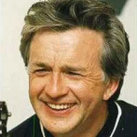

Советский и российский поп-рок-музыкант, композитор. Вместе с Владимиром Кузьминым являлся основателем и участником основатель группы *Карнавал*.

* [Аэропорт](Аэропорт.md)
* [Маленькая Москва](Маленькая%20Москва.md)
* [Песня о друге](Песня%20о%20друге.md)
* [Стоп-мотор](Стоп-мотор.md)
* [Я буду долго гнать велосипед](Я%20буду%20долго%20гнать%20велосипед.md)