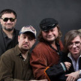

Советская и российская музыкальная группа, лидером является музыкант и поэт Вадим Степанцов.

* [8-е марта](8-е%20марта.md)
* [Анархистка](Анархистка.md)
* [Бухгалтер Иванов](Бухгалтер%20Иванов.md)
* [В Ростове у рынка центрального](В%20Ростове%20у%20рынка%20центрального.md)
* [Дьявольская месса](Дьявольская%20месса.md)
* [Есть только миг (2 вариант)](Есть%20только%20миг%20(2%20вариант).md)
* [Есть только миг](Есть%20только%20миг.md)
* [Импepия](Импepия.md)
* [Империя](Империя.md)
* [Клинический Рок-н-Ролл](Клинический%20Рок-н-Ролл.md)
* [Козаче](Козаче.md)
* [Лола](Лола.md)
* [Нeвecтa Cepeжинa](Нeвecтa%20Cepeжинa.md)
* [Невеста Сережина](Невеста%20Сережина.md)
* [Осень в поле рыскает](Осень%20в%20поле%20рыскает.md)
* [Пионервожатая](Пионервожатая.md)
* [Раздень меня по телефону](Раздень%20меня%20по%20телефону.md)
* [Таня, Танюша](Таня,%20Танюша.md)
* [Хуанита](Хуанита.md)
* [Чесотка](Чесотка.md)