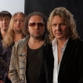

Российская музыкальная группа, основанная в 1997 году. Исполняет песни в стиле романса. Основатель группы и первый исполнитель бизнесмен Владимир Жечков.

* [А в чистом поле](А%20в%20чистом%20поле.txt)
* [Без тебя не могу](Без%20тебя%20не%20могу.txt)
* [Горький мед](Горький%20мед.txt)
* [Как упоительны в России вечера](Как%20упоительны%20в%20России%20вечера.txt)
* [Когда ты вернешься](Когда%20ты%20вернешься.txt)
* [Любовь такая](Любовь%20такая.txt)
* [Потому что нельзя...](Потому%20что%20нельзя....txt)
* [Слепой сын](Слепой%20сын.txt)