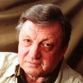

Советский и российский бард, композитор.

* [Альма Матер](Альма%20Матер.txt)
* [В сельском клубе](В%20сельском%20клубе.txt)
* [Вспомните, ребята](Вспомните,%20ребята.txt)
* [Гренада](Гренада.txt)
* [Закон дороги простой](Закон%20дороги%20простой.txt)
* [Каждый выбирает для себя](Каждый%20выбирает%20для%20себя.txt)
* [Колечко](Колечко.txt)
* [Контрабандисты](Контрабандисты.txt)
* [Куда ты уехала, Сью](Куда%20ты%20уехала,%20Сью.txt)
* [Лошади в океане](Лошади%20в%20океане.txt)
* [Март-Апрель](Март-Апрель.txt)
* [Мой город](Мой%20город.txt)
* [Ну что с того, что я там был](Ну%20что%20с%20того,%20что%20я%20там%20был.txt)
* [О, славный миг, когда старик](О,%20славный%20миг,%20когда%20старик.txt)
* [Песенка про собачку Тябу](Песенка%20про%20собачку%20Тябу.txt)
* [Песня шагом, шагом](Песня%20шагом,%20шагом.txt)
* [Под музыку Вивальди](Под%20музыку%20Вивальди.txt)
* [Прекрасная волна](Прекрасная%20волна.txt)
* [Снега выпадают](Снега%20выпадают.txt)
* [Сороковые](Сороковые.txt)
* [Трубачи](Трубачи.txt)
* [Эту пряную перину](Эту%20пряную%20перину.txt)