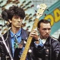

Советская и российская рок-группа.

* [Have You Ever Seen The Rain](Have%20You%20Ever%20Seen%20The%20Rain.md)
* [I Need A Needle](I%20Need%20A%20Needle.md)
* [Playboy](Playboy.md)
* [Telephone Call From Istanbul](Telephone%20Call%20From%20Istanbul.md)
* [Аллергия](Аллергия.md)
* [Банька по-белому](Банька%20по-белому.md)
* [Белый колпак](Белый%20колпак.md)
* [Бродяга](Бродяга.md)
* [Вальс Москва](Вальс%20Москва.md)
* [Верь моим словам](Верь%20моим%20словам.md)
* [Всё это рок-н-ролл](Всё%20это%20рок-н-ролл.md)
* [Гады](Гады.md)
* [Дай мне руку](Дай%20мне%20руку.md)
* [Дорожная](Дорожная.md)
* [Если ты хочешь уйти](Если%20ты%20хочешь%20уйти.md)
* [Запретная зона](Запретная%20зона.md)
* [Звезда микрорайона](Звезда%20микрорайона.md)
* [Зона Z](Зона%20Z.md)
* [Красиво, когда высоко](Красиво,%20когда%20высоко.md)
* [На перекрёстке Луны](На%20перекрёстке%20Луны.md)
* [Наследник эпохи](Наследник%20эпохи.md)
* [Не отвечай](Не%20отвечай.md)
* [Не ходите за нами](Не%20ходите%20за%20нами.md)
* [Несерьёзная прогулка](Несерьёзная%20прогулка.md)
* [Нонсенс](Нонсенс.md)
* [Ностальгическое танго](Ностальгическое%20танго.md)
* [Оглянись](Оглянись.md)
* [Песнь о любви и гармонии](Песнь%20о%20любви%20и%20гармонии.md)
* [По дороге разочарований](По%20дороге%20разочарований.md)
* [Поплачь о нём](Поплачь%20о%20нём.md)
* [Рай](Рай.md)
* [Реки](Реки.md)
* [Розовый след на белой дороге](Розовый%20след%20на%20белой%20дороге.md)
* [Сантехник](Сантехник.md)
* [Серый голубь](Серый%20голубь.md)
* [Скорый поезд придёт ровно в шесть часов](Скорый%20поезд%20придёт%20ровно%20в%20шесть%20часов.md)
* [Счастливчик](Счастливчик.md)
* [Там, где кончается дождь](Там,%20где%20кончается%20дождь.md)
* [Фантомас](Фантомас.md)
* [Человек в шляпе](Человек%20в%20шляпе.md)
* [Чем пахнут твои деньги](Чем%20пахнут%20твои%20деньги.md)
* [Эй, мама, я погиб на войне](Эй,%20мама,%20я%20погиб%20на%20войне.md)
* [Эксгибиционист](Эксгибиционист.md)
* [Я Милoгo Узнaю Пo Пoxoдкe](Я%20Милoгo%20Узнaю%20Пo%20Пoxoдкe.md)
* [Я закрываю глаза](Я%20закрываю%20глаза.md)
* [Я обожаю JAZZ](Я%20обожаю%20JAZZ.md)
* [Я так хочу](Я%20так%20хочу.md)