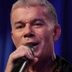

Российский популярный эстрадный певец. Народный артист России.

* [Белый снег](Белый%20снег.md)
* [Вперед Россия](Вперед%20Россия.md)
* [Детство мое](Детство%20мое.md)
* [Дождись меня (2)](Дождись%20меня%20(2).md)
* [Дождись меня](Дождись%20меня.md)
* [Доля](Доля.md)
* [Мама](Мама.md)
* [Мои ясные дни (2)](Мои%20ясные%20дни%20(2).md)
* [Мои ясные дни](Мои%20ясные%20дни.md)
* [Мой храм](Мой%20храм.md)
* [На заре](На%20заре.md)
* [Офицеры](Офицеры.md)
* [Петербург](Петербург.md)
* [Прощай](Прощай.md)
* [Путана](Путана.md)
* [Родники](Родники.md)
* [Свежий ветер](Свежий%20ветер.md)
* [Туман](Туман.md)
* [Эскадрон](Эскадрон.md)