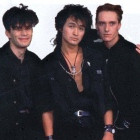

Одна из самых популярных советских рок-групп *1980-х* годов.  
Лидер и автор практически всех текстов и музыки *Виктор Цой*.  
Кроме него в состав группы входили гитаристы *Алексей Рыбин* и *Юрий Каспарян*,  
басисты *Юрий Титов* и *Игорь Тихомиров*, барабанщик *Георгий Гурьянов*.

* [А мне не нpавится гоpод Москва](А%20мне%20не%20нpавится%20гоpод%20Москва.md)
* [Алюминиевые Огурцы (2 вариант)](Алюминиевые%20Огурцы%20(2%20вариант).md)
* [Алюминиевые огурцы](Алюминиевые%20огурцы.md)
* [Анархия](Анархия.md)
* [Апрель](Апрель.md)
* [Ария мистера Х](Ария%20мистера%20Х.md)
* [Асфальт](Асфальт.md)
* [Атаман](Атаман.md)
* [Без десяти (2 вариант)](Без%20десяти%20(2%20вариант).md)
* [Без десяти](Без%20десяти.md)
* [Бездельник #1](Бездельник%20#1.md)
* [Бездельник #2](Бездельник%20#2.md)
* [Бездельник-2](Бездельник-2.md)
* [Безъядерная зона](Безъядерная%20зона.md)
* [Белый День](Белый%20День.md)
* [Блюз Артёму Троицкому](Блюз%20Артёму%20Троицкому.md)
* [Бошетунмай](Бошетунмай.md)
* [Братская любовь](Братская%20любовь.md)
* [В наших глазах](В%20наших%20глазах.md)
* [В поисках сюжета](В%20поисках%20сюжета.md)
* [Вера-Надежда-Любовь](Вера-Надежда-Любовь.md)
* [Верь мне](Верь%20мне.md)
* [Весна](Весна.md)
* [Видели ночь](Видели%20ночь.md)
* [Водка искусный напиток...](Водка%20искусный%20напиток....md)
* [Водка — вкусный напиток](Водка%20—%20вкусный%20напиток.md)
* [Война](Война.md)
* [Вопрос](Вопрос.md)
* [Восьмиклассница](Восьмиклассница.md)
* [Время есть, а денег нет](Время%20есть,%20а%20денег%20нет.md)
* [Генерал](Генерал.md)
* [Город](Город.md)
* [Городской мотылек](Городской%20мотылек.md)
* [Гость](Гость.md)
* [Группа крови](Группа%20крови.md)
* [Дальше действовать будем мы](Дальше%20действовать%20будем%20мы.md)
* [Девушка](Девушка.md)
* [Дерево](Дерево.md)
* [Дети проходных дворов](Дети%20проходных%20дворов.md)
* [Дождь для нас](Дождь%20для%20нас.md)
* [Жизнь в стеклах](Жизнь%20в%20стеклах.md)
* [Завтра война](Завтра%20война.md)
* [Закрой за мной дверь, я ухожу](Закрой%20за%20мной%20дверь,%20я%20ухожу.md)
* [Застоялся мой поезд...](Застоялся%20мой%20поезд....md)
* [Звезда (Вера - надежда - любовь)](Звезда%20(Вера%20-%20надежда%20-%20любовь).md)
* [Звезда по имени Солнце](Звезда%20по%20имени%20Солнце.md)
* [Звезда](Звезда.md)
* [Звезды останутся здесь](Звезды%20останутся%20здесь.md)
* [Звери](Звери.md)
* [Игра](Игра.md)
* [Каждую ночь](Каждую%20ночь.md)
* [Камчатка](Камчатка.md)
* [Когда твоя девушка больна](Когда%20твоя%20девушка%20больна.md)
* [Когда-то ты был битником](Когда-то%20ты%20был%20битником.md)
* [Кончится лето](Кончится%20лето.md)
* [Красно-желтые дни](Красно-желтые%20дни.md)
* [Кукушка](Кукушка.md)
* [Лауреат](Лауреат.md)
* [Легенда](Легенда.md)
* [Лето](Лето.md)
* [Любовь - это не шутка](Любовь%20-%20это%20не%20шутка.md)
* [Малыш](Малыш.md)
* [Мама Анархия](Мама%20Анархия.md)
* [Мама, мы все сошли с ума](Мама,%20мы%20все%20сошли%20с%20ума.md)
* [Место для шага вперед](Место%20для%20шага%20вперед.md)
* [Мне всё равно](Мне%20всё%20равно.md)
* [Мне не нравится город Москва](Мне%20не%20нравится%20город%20Москва.md)
* [Мои друзья](Мои%20друзья.md)
* [Моё настроение](Моё%20настроение.md)
* [Музыка волн](Музыка%20волн.md)
* [Муравейник](Муравейник.md)
* [Мы хотим танцевать](Мы%20хотим%20танцевать.md)
* [На кухне](На%20кухне.md)
* [Над полями туман...](Над%20полями%20туман....md)
* [Нам с тобой](Нам%20с%20тобой.md)
* [Начинается новый день...](Начинается%20новый%20день....md)
* [Невеселая песня](Невеселая%20песня.md)
* [Ночной грабитель](Ночной%20грабитель.md)
* [Ночь](Ночь.md)
* [Однaжды](Однaжды.md)
* [Около семи утра](Около%20семи%20утра.md)
* [Они сказали Надо пройти](Они%20сказали%20Надо%20пройти.md)
* [Осень (Песня для БГ)](Осень%20(Песня%20для%20БГ).md)
* [Пачка сигарет (табы)](Пачка%20сигарет%20(табы).md)
* [Пачка сигарет](Пачка%20сигарет.md)
* [Перемен](Перемен.md)
* [Песня без слов](Песня%20без%20слов.md)
* [Песня для БГ](Песня%20для%20БГ.md)
* [Песня для МБ](Песня%20для%20МБ.md)
* [Песня кочегарам](Песня%20кочегарам.md)
* [Печаль](Печаль.md)
* [Подросток](Подросток.md)
* [Попробуй спеть вместе со мной](Попробуй%20спеть%20вместе%20со%20мной.md)
* [Пора](Пора.md)
* [Последний герой](Последний%20герой.md)
* [Прогулка романтика](Прогулка%20романтика.md)
* [Проснись](Проснись.md)
* [Просто хочешь ты знать](Просто%20хочешь%20ты%20знать.md)
* [Прохожий](Прохожий.md)
* [Разреши мне](Разреши%20мне.md)
* [Раньше в твоих глазах...](Раньше%20в%20твоих%20глазах....md)
* [Растопите снег](Растопите%20снег.md)
* [Рядом со мной](Рядом%20со%20мной.md)
* [Саша](Саша.md)
* [Сельва](Сельва.md)
* [Серая тень](Серая%20тень.md)
* [Ситар играл](Ситар%20играл.md)
* [Сказка](Сказка.md)
* [Скоро будет зима](Скоро%20будет%20зима.md)
* [Скоро кончится лето](Скоро%20кончится%20лето.md)
* [Следи за собой](Следи%20за%20собой.md)
* [Словно тень бегу куда-то я...](Словно%20тень%20бегу%20куда-то%20я....md)
* [Солнечные дни](Солнечные%20дни.md)
* [Сосны на морском берегу](Сосны%20на%20морском%20берегу.md)
* [Спокойная ночь](Спокойная%20ночь.md)
* [Стань птицей...](Стань%20птицей....md)
* [Стань птицей](Стань%20птицей.md)
* [Странная сказка](Странная%20сказка.md)
* [Стук](Стук.md)
* [Сюжет для новой песни](Сюжет%20для%20новой%20песни.md)
* [Танец](Танец.md)
* [Танцуй со мной](Танцуй%20со%20мной.md)
* [Твой номер](Твой%20номер.md)
* [Транквилизатор](Транквилизатор.md)
* [Троллейбус](Троллейбус.md)
* [Ты был когда-то битником](Ты%20был%20когда-то%20битником.md)
* [Ты выглядишь так несовременно рядом со мной](Ты%20выглядишь%20так%20несовременно%20рядом%20со%20мной.md)
* [Ты выглядишь так несовременно](Ты%20выглядишь%20так%20несовременно.md)
* [Ты есть](Ты%20есть.md)
* [Ты играла со мной](Ты%20играла%20со%20мной.md)
* [Ты мог бы...](Ты%20мог%20бы....md)
* [Ты обвела меня вокруг пальца](Ты%20обвела%20меня%20вокруг%20пальца.md)
* [Ты смотришь назад...](Ты%20смотришь%20назад....md)
* [Уезжаю куда-то...](Уезжаю%20куда-то....md)
* [Уходи](Уходи.md)
* [Фильмы](Фильмы.md)
* [Холодильник](Холодильник.md)
* [Хочу быть с тобой](Хочу%20быть%20с%20тобой.md)
* [Хочу перемен](Хочу%20перемен.md)
* [Черная река](Черная%20река.md)
* [Шаг вперед](Шаг%20вперед.md)
* [Электричка](Электричка.md)
* [Это - любовь](Это%20-%20любовь.md)
* [Это не любовь](Это%20не%20любовь.md)
* [Я - асфальт](Я%20-%20асфальт.md)
* [Я выключаю телевизор...](Я%20выключаю%20телевизор....md)
* [Я иду по улице](Я%20иду%20по%20улице.md)
* [Я из тех](Я%20из%20тех.md)
* [Я объявляю свой дом](Я%20объявляю%20свой%20дом.md)
* [Я смотрю в окно мне дождь помыл стекло](Я%20смотрю%20в%20окно%20мне%20дождь%20помыл%20стекло.md)
* [Я хочу быть кочегаром](Я%20хочу%20быть%20кочегаром.md)
* [Я хочу быть с тобой](Я%20хочу%20быть%20с%20тобой.md)