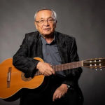

Советский, российский и израильский поэт, драматург, бард.

* [Барон Жермон](Барон%20Жермон.txt)
* [Лирическая](Лирическая.txt)
* [Нет, я не плачу](Нет,%20я%20не%20плачу.txt)
* [Песенка отважного капитана](Песенка%20отважного%20капитана.txt)
* [Песня Красной Шапочки](Песня%20Красной%20Шапочки.txt)
* [Рыба-кит](Рыба-кит.txt)
* [Фантастика-романтика](Фантастика-романтика.txt)
* [Хорошее настроение](Хорошее%20настроение.txt)
* [Черное Море](Черное%20Море.txt)