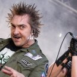

Российская панк-рок группа из Санкт-Петербурга. Основана Михаилом Горшенёвым (Горшок) и Андреем Князевым (Князь) в 1988 году. Распалась в 2013 году после смерти Михаила Горшенёва.

* [Бедняжка (2 вариант)](Бедняжка%20(2%20вариант).md)
* [Бедняжка](Бедняжка.md)
* [Блуждают тени (2 вариант)](Блуждают%20тени%20(2%20вариант).md)
* [Блуждают тени](Блуждают%20тени.md)
* [Бродяга и старик (2 вариант)](Бродяга%20и%20старик%20(2%20вариант).md)
* [Бродяга и старик](Бродяга%20и%20старик.md)
* [Бубенчик](Бубенчик.md)
* [Бунт на корабле](Бунт%20на%20корабле.md)
* [В гостях у соседа](В%20гостях%20у%20соседа.md)
* [В доме суета](В%20доме%20суета.md)
* [Валет и Дама (2 вариант)](Валет%20и%20Дама%20(2%20вариант).md)
* [Валет и Дама (3 вариант)](Валет%20и%20Дама%20(3%20вариант).md)
* [Валет и Дама](Валет%20и%20Дама.md)
* [Вампир](Вампир.md)
* [Вдова и Горбун (2 вариант)](Вдова%20и%20Горбун%20(2%20вариант).md)
* [Вдова и Горбун (3 вариант)](Вдова%20и%20Горбун%20(3%20вариант).md)
* [Вдова и Горбун](Вдова%20и%20Горбун.md)
* [Ведьма и Осел](Ведьма%20и%20Осел.md)
* [Ведьма и осел (2 вариант)](Ведьма%20и%20осел%20(2%20вариант).md)
* [Ведьма и осел (3 вариант)](Ведьма%20и%20осел%20(3%20вариант).md)
* [Верная Жена](Верная%20Жена.md)
* [Верная жена (2 вариант)](Верная%20жена%20(2%20вариант).md)
* [Верная жена (3 вариант)](Верная%20жена%20(3%20вариант).md)
* [Веселые Тролли](Веселые%20Тролли.md)
* [Вино Хоббитов (2 вариант)](Вино%20Хоббитов%20(2%20вариант).md)
* [Вино Хоббитов](Вино%20Хоббитов.md)
* [Внезапная голова](Внезапная%20голова.md)
* [Водяной (2 вариант)](Водяной%20(2%20вариант).md)
* [Водяной](Водяной.md)
* [Возвращение колдуна (2 вариант)](Возвращение%20колдуна%20(2%20вариант).md)
* [Возвращение колдуна](Возвращение%20колдуна.md)
* [Волосокрад (2 вариант)](Волосокрад%20(2%20вариант).md)
* [Волосокрад (3 вариант)](Волосокрад%20(3%20вариант).md)
* [Волосокрад (4 вариант)](Волосокрад%20(4%20вариант).md)
* [Волосокрад](Волосокрад.md)
* [Волшебный глаз старика Алонса](Волшебный%20глаз%20старика%20Алонса.md)
* [Вор, Граф и Графиня](Вор,%20Граф%20и%20Графиня.md)
* [Воспоминание о мертвой женщине](Воспоминание%20о%20мертвой%20женщине.md)
* [Воспоминания о былой любви (2 вариант)](Воспоминания%20о%20былой%20любви%20(2%20вариант).md)
* [Воспоминания о былой любви (3 вариант)](Воспоминания%20о%20былой%20любви%20(3%20вариант).md)
* [Воспоминания о былой любви (4 вариант)](Воспоминания%20о%20былой%20любви%20(4%20вариант).md)
* [Воспоминания о былой любви](Воспоминания%20о%20былой%20любви.md)
* [Воспоминания о мертвой женщине](Воспоминания%20о%20мертвой%20женщине.md)
* [Вячеслав](Вячеслав.md)
* [Генрих и Смерть (2 вариант)](Генрих%20и%20Смерть%20(2%20вариант).md)
* [Генрих и Смерть](Генрих%20и%20Смерть.md)
* [Гимн шута (2 вариант)](Гимн%20шута%20(2%20вариант).md)
* [Гимн шута (3 вариант)](Гимн%20шута%20(3%20вариант).md)
* [Гимн шута](Гимн%20шута.md)
* [Голые коки (2 вариант)](Голые%20коки%20(2%20вариант).md)
* [Голые коки](Голые%20коки.md)
* [Город мертвецов](Город%20мертвецов.md)
* [Гробовщик](Гробовщик.md)
* [Два вора и монета (2 вариант)](Два%20вора%20и%20монета%20(2%20вариант).md)
* [Два вора и монета](Два%20вора%20и%20монета.md)
* [Два друга и разбойники (2 вариант)](Два%20друга%20и%20разбойники%20(2%20вариант).md)
* [Два друга и разбойники (3 вариант)](Два%20друга%20и%20разбойники%20(3%20вариант).md)
* [Два друга и разбойники (4 вариант)](Два%20друга%20и%20разбойники%20(4%20вариант).md)
* [Два друга и разбойники (5 вариант)](Два%20друга%20и%20разбойники%20(5%20вариант).md)
* [Два друга и разбойники](Два%20друга%20и%20разбойники.md)
* [Два монаха в одну ночь (2 вариант)](Два%20монаха%20в%20одну%20ночь%20(2%20вариант).md)
* [Два монаха в одну ночь](Два%20монаха%20в%20одну%20ночь.md)
* [Двухголовый отпрыск (2 вариант)](Двухголовый%20отпрыск%20(2%20вариант).md)
* [Двухголовый отпрыск](Двухголовый%20отпрыск.md)
* [Девушка и Граф](Девушка%20и%20Граф.md)
* [Девушка и граф (2 вариант)](Девушка%20и%20граф%20(2%20вариант).md)
* [Девушка и граф (3 вариант)](Девушка%20и%20граф%20(3%20вариант).md)
* [Дед на свадьбе (2 вариант)](Дед%20на%20свадьбе%20(2%20вариант).md)
* [Дед на свадьбе](Дед%20на%20свадьбе.md)
* [Деньги](Деньги.md)
* [Джокер](Джокер.md)
* [Долой гопоту](Долой%20гопоту.md)
* [Дочка вурдалака](Дочка%20вурдалака.md)
* [Дурак и молния (2 вариант)](Дурак%20и%20молния%20(2%20вариант).md)
* [Дурак и молния (3 вариант)](Дурак%20и%20молния%20(3%20вариант).md)
* [Дурак и молния](Дурак%20и%20молния.md)
* [Екатерина (2 вариант)](Екатерина%20(2%20вариант).md)
* [Екатерина](Екатерина.md)
* [Ели мясо мужики](Ели%20мясо%20мужики.md)
* [Жаль, нет ружья (2 вариант)](Жаль,%20нет%20ружья%20(2%20вариант).md)
* [Жаль, нет ружья (3 вариант)](Жаль,%20нет%20ружья%20(3%20вариант).md)
* [Жаль, нет ружья](Жаль,%20нет%20ружья.md)
* [Жизнь](Жизнь.md)
* [Забытые ботинки (2 вариант)](Забытые%20ботинки%20(2%20вариант).md)
* [Забытые ботинки (3 вариант)](Забытые%20ботинки%20(3%20вариант).md)
* [Забытые ботинки](Забытые%20ботинки.md)
* [Задира и солдат](Задира%20и%20солдат.md)
* [Запрет Отца](Запрет%20Отца.md)
* [Защитник свиней](Защитник%20свиней.md)
* [Звонок](Звонок.md)
* [Зловещий кузен](Зловещий%20кузен.md)
* [Злодей и шапка (2 вариант)](Злодей%20и%20шапка%20(2%20вариант).md)
* [Злодей и шапка](Злодей%20и%20шапка.md)
* [Иван Факов](Иван%20Факов.md)
* [Идол](Идол.md)
* [Инквизитор](Инквизитор.md)
* [Инструмент](Инструмент.md)
* [Исповедь вампира](Исповедь%20вампира.md)
* [Истинный убийца](Истинный%20убийца.md)
* [История о мертвой женщине](История%20о%20мертвой%20женщине.md)
* [История, окутанная тайной (2 вариант)](История,%20окутанная%20тайной%20(2%20вариант).md)
* [История, окутанная тайной](История,%20окутанная%20тайной.md)
* [Камнем по голове](Камнем%20по%20голове.md)
* [Карапуз (2 вариант)](Карапуз%20(2%20вариант).md)
* [Карапуз](Карапуз.md)
* [Квартира](Квартира.md)
* [Кировский завод](Кировский%20завод.md)
* [Король и Шут](Король%20и%20Шут.md)
* [Красавец-Мерзавец](Красавец-Мерзавец.md)
* [Кто это все придумал (2 вариант)](Кто%20это%20все%20придумал%20(2%20вариант).md)
* [Кто это все придумал](Кто%20это%20все%20придумал.md)
* [Кто это всё придумал (3 Вариант)](Кто%20это%20всё%20придумал%20(3%20Вариант).md)
* [Кузнец (2 вариант)](Кузнец%20(2%20вариант).md)
* [Кузнец](Кузнец.md)
* [Кузьма и барин](Кузьма%20и%20барин.md)
* [Кукла колдуна (2 вариант)](Кукла%20колдуна%20(2%20вариант).md)
* [Кукла колдуна](Кукла%20колдуна.md)
* [Кукольный театр (2 вариант)](Кукольный%20театр%20(2%20вариант).md)
* [Кукольный театр](Кукольный%20театр.md)
* [Лесник (2 вариант)](Лесник%20(2%20вариант).md)
* [Лесник (3 вариант)](Лесник%20(3%20вариант).md)
* [Лесник (4 вариант)](Лесник%20(4%20вариант).md)
* [Лесник (5 вариант)](Лесник%20(5%20вариант).md)
* [Лесник](Лесник.md)
* [Лесные разбойники (2 вариант)](Лесные%20разбойники%20(2%20вариант).md)
* [Лесные разбойники](Лесные%20разбойники.md)
* [Леший обиделся (2 вариант)](Леший%20обиделся%20(2%20вариант).md)
* [Леший обиделся](Леший%20обиделся.md)
* [Любовь и пропеллер](Любовь%20и%20пропеллер.md)
* [Марионетки](Марионетки.md)
* [Мария (2 вариант)](Мария%20(2%20вариант).md)
* [Мария (3 вариант)](Мария%20(3%20вариант).md)
* [Мария (4 вариант)](Мария%20(4%20вариант).md)
* [Мария](Мария.md)
* [Маска](Маска.md)
* [Мастеp пpиглашает гости](Мастеp%20пpиглашает%20гости.md)
* [Мастер приглашает в гости (2 вариант)](Мастер%20приглашает%20в%20гости%20(2%20вариант).md)
* [Мастер приглашает в гости (3 вариант)](Мастер%20приглашает%20в%20гости%20(3%20вариант).md)
* [Мастер приглашает в гости (4 вариант)](Мастер%20приглашает%20в%20гости%20(4%20вариант).md)
* [Мастер приглашает в гости](Мастер%20приглашает%20в%20гости.md)
* [Матёрый волк](Матёрый%20волк.md)
* [Медведь](Медведь.md)
* [Мертвый анархист (2 вариант)](Мертвый%20анархист%20(2%20вариант).md)
* [Мертвый анархист (3 вариант)](Мертвый%20анархист%20(3%20вариант).md)
* [Мертвый анархист (4 вариант)](Мертвый%20анархист%20(4%20вариант).md)
* [Мертвый анархист](Мертвый%20анархист.md)
* [Месть Гарри](Месть%20Гарри.md)
* [Милое дело](Милое%20дело.md)
* [Мой Характер](Мой%20Характер.md)
* [Мой характер (2 вариант)](Мой%20характер%20(2%20вариант).md)
* [Мотоцикл (2 вариант)](Мотоцикл%20(2%20вариант).md)
* [Мотоцикл](Мотоцикл.md)
* [Мухи (2 вариант)](Мухи%20(2%20вариант).md)
* [Мухи (3 вариант)](Мухи%20(3%20вариант).md)
* [Мухи](Мухи.md)
* [Наблюдатель](Наблюдатель.md)
* [Невеста Палача](Невеста%20Палача.md)
* [Невеста палача (2 вариант)](Невеста%20палача%20(2%20вариант).md)
* [Невеста палача (3 вариант)](Невеста%20палача%20(3%20вариант).md)
* [Некромант](Некромант.md)
* [Он не знает, что такое жить (2 вариант)](Он%20не%20знает,%20что%20такое%20жить%20(2%20вариант).md)
* [Он не знает, что такое жить (3 вариант)](Он%20не%20знает,%20что%20такое%20жить%20(3%20вариант).md)
* [Он не знает, что такое жить](Он%20не%20знает,%20что%20такое%20жить.md)
* [От женщин кpугом голова](От%20женщин%20кpугом%20голова.md)
* [От женщин кругом голова (2 вариант)](От%20женщин%20кругом%20голова%20(2%20вариант).md)
* [От женщин кругом голова](От%20женщин%20кругом%20голова.md)
* [Ответ - лютая месть](Ответ%20-%20лютая%20месть.md)
* [Отец и маски](Отец%20и%20маски.md)
* [Отражение](Отражение.md)
* [Охотник (2 вариант)](Охотник%20(2%20вариант).md)
* [Охотник (3 вариант)](Охотник%20(3%20вариант).md)
* [Охотник](Охотник.md)
* [Паника в селе](Паника%20в%20селе.md)
* [Парень и Леший (2 вариант)](Парень%20и%20Леший%20(2%20вариант).md)
* [Парень и Леший (3 вариант)](Парень%20и%20Леший%20(3%20вариант).md)
* [Парень и Леший](Парень%20и%20Леший.md)
* [Песенка пьяного деда (2 вариант)](Песенка%20пьяного%20деда%20(2%20вариант).md)
* [Песенка пьяного деда (3 вариант)](Песенка%20пьяного%20деда%20(3%20вариант).md)
* [Песенка пьяного деда](Песенка%20пьяного%20деда.md)
* [Песня Мушкетеров](Песня%20Мушкетеров.md)
* [Песня пьяного деда](Песня%20пьяного%20деда.md)
* [Пивной череп](Пивной%20череп.md)
* [Пират](Пират.md)
* [Писатель Гудвин](Писатель%20Гудвин.md)
* [Пляски на могиле](Пляски%20на%20могиле.md)
* [Помнят с горечью древляне](Помнят%20с%20горечью%20древляне.md)
* [Помоги мне](Помоги%20мне.md)
* [Похороны панка (2 вариант)](Похороны%20панка%20(2%20вариант).md)
* [Похороны панка (3 вариант)](Похороны%20панка%20(3%20вариант).md)
* [Похороны панка](Похороны%20панка.md)
* [Представляю я (2 вариант)](Представляю%20я%20(2%20вариант).md)
* [Представляю я](Представляю%20я.md)
* [Прерванная любовь или Арбузная корка (2 вариант)](Прерванная%20любовь%20или%20Арбузная%20корка%20(2%20вариант).md)
* [Прерванная любовь или Арбузная корка (3 вариант)](Прерванная%20любовь%20или%20Арбузная%20корка%20(3%20вариант).md)
* [Прерванная любовь или Арбузная корка](Прерванная%20любовь%20или%20Арбузная%20корка.md)
* [Про Ивана](Про%20Ивана.md)
* [Прогулка](Прогулка.md)
* [Продавец кошмаров](Продавец%20кошмаров.md)
* [Проказник скоморох (2 вариант)](Проказник%20скоморох%20(2%20вариант).md)
* [Проказник скоморох](Проказник%20скоморох.md)
* [Проклятый старый дом (2 вариант)](Проклятый%20старый%20дом%20(2%20вариант).md)
* [Проклятый старый дом (3 вариант)](Проклятый%20старый%20дом%20(3%20вариант).md)
* [Проклятый старый дом (4 вариант)](Проклятый%20старый%20дом%20(4%20вариант).md)
* [Проклятый старый дом (5 вариант)](Проклятый%20старый%20дом%20(5%20вариант).md)
* [Проклятый старый дом (6 вариант)](Проклятый%20старый%20дом%20(6%20вариант).md)
* [Проклятый старый дом](Проклятый%20старый%20дом.md)
* [Прыгну со скалы (2 вариант)](Прыгну%20со%20скалы%20(2%20вариант).md)
* [Прыгну со скалы (3 вариант)](Прыгну%20со%20скалы%20(3%20вариант).md)
* [Прыгну со скалы (4 вариант)](Прыгну%20со%20скалы%20(4%20вариант).md)
* [Прыгну со скалы (5 вариант)](Прыгну%20со%20скалы%20(5%20вариант).md)
* [Прыгну со скалы](Прыгну%20со%20скалы.md)
* [Пьянка (2 вариант)](Пьянка%20(2%20вариант).md)
* [Пьянка](Пьянка.md)
* [Разборки из-за баб](Разборки%20из-за%20баб.md)
* [Разговор с гоблином (2 вариант)](Разговор%20с%20гоблином%20(2%20вариант).md)
* [Разговор с гоблином](Разговор%20с%20гоблином.md)
* [Раненый воин](Раненый%20воин.md)
* [Рогатый (2 вариант)](Рогатый%20(2%20вариант).md)
* [Рогатый (3 вариант)](Рогатый%20(3%20вариант).md)
* [Рогатый (4 вариант)](Рогатый%20(4%20вариант).md)
* [Рогатый](Рогатый.md)
* [Розовая вода](Розовая%20вода.md)
* [Ром](Ром.md)
* [Рыбак](Рыбак.md)
* [Рыцарь](Рыцарь.md)
* [С тех пор как он ушел](С%20тех%20пор%20как%20он%20ушел.md)
* [С тех пор, как он ушел (2 вариант)](С%20тех%20пор,%20как%20он%20ушел%20(2%20вариант).md)
* [С тех пор, как он ушел](С%20тех%20пор,%20как%20он%20ушел.md)
* [Садовник](Садовник.md)
* [Сапоги мертвеца (2 вариант)](Сапоги%20мертвеца%20(2%20вариант).md)
* [Сапоги мертвеца](Сапоги%20мертвеца.md)
* [Сапоги](Сапоги.md)
* [Свой среди чужих](Свой%20среди%20чужих.md)
* [Северный флот](Северный%20флот.md)
* [Сказка про дракона](Сказка%20про%20дракона.md)
* [Скоморох](Скоморох.md)
* [Скотный двор](Скотный%20двор.md)
* [Следи за собой (2 вариант)](Следи%20за%20собой%20(2%20вариант).md)
* [Следи за собой](Следи%20за%20собой.md)
* [Смельчак и ветеp](Смельчак%20и%20ветеp.md)
* [Смельчак и ветер (2 вариант)](Смельчак%20и%20ветер%20(2%20вариант).md)
* [Смельчак и ветер (3 вариант)](Смельчак%20и%20ветер%20(3%20вариант).md)
* [Смерть халдея](Смерть%20халдея.md)
* [Смешной совет (2 вариант)](Смешной%20совет%20(2%20вариант).md)
* [Смешной совет](Смешной%20совет.md)
* [Собрание (2 вариант)](Собрание%20(2%20вариант).md)
* [Собрание (3 вариант)](Собрание%20(3%20вариант).md)
* [Собрание](Собрание.md)
* [Соловьи](Соловьи.md)
* [Сосиска (2 вариант)](Сосиска%20(2%20вариант).md)
* [Сосиска](Сосиска.md)
* [Спятил отец (2 вариант)](Спятил%20отец%20(2%20вариант).md)
* [Спятил отец (3 вариант)](Спятил%20отец%20(3%20вариант).md)
* [Спятил отец](Спятил%20отец.md)
* [Старинные часы](Старинные%20часы.md)
* [Та что смотрит из пруда](Та%20что%20смотрит%20из%20пруда.md)
* [Тайна хозяйки старинных часов (2 вариант)](Тайна%20хозяйки%20старинных%20часов%20(2%20вариант).md)
* [Тайна хозяйки старинных часов](Тайна%20хозяйки%20старинных%20часов.md)
* [Тяни (2 вариант)](Тяни%20(2%20вариант).md)
* [Тяни](Тяни.md)
* [Утопленник (2 вариант)](Утопленник%20(2%20вариант).md)
* [Утопленник](Утопленник.md)
* [Утренний рассвет (2 вариант)](Утренний%20рассвет%20(2%20вариант).md)
* [Утренний рассвет (3 вариант)](Утренний%20рассвет%20(3%20вариант).md)
* [Утренний рассвет](Утренний%20рассвет.md)
* [Хардкор по-русски](Хардкор%20по-русски.md)
* [Хозяин леса](Хозяин%20леса.md)
* [Хозяин таверны](Хозяин%20таверны.md)
* [Холодное тело](Холодное%20тело.md)
* [Хороший пират - мёртвый пират](Хороший%20пират%20-%20мёртвый%20пират.md)
* [Чойболсан](Чойболсан.md)
* [Что видел малыш](Что%20видел%20малыш.md)
* [Шар Голубой](Шар%20Голубой.md)
* [Я никому не нужен](Я%20никому%20не%20нужен.md)