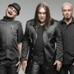

Российская рок-группа Алексея Горшенёва, младшего брата Михаила Горшенёва, основателя группы **Король и Шут**

* [9-я рота](9-я%20рота.md)
* [Depeche Mode](Depeche%20Mode.md)
* [Беспокойный](Беспокойный.md)
* [Вертикаль](Вертикаль.md)
* [Герой](Герой.md)
* [Города](Города.md)
* [Да здравствует сюрприз](Да%20здравствует%20сюрприз.md)
* [Движение](Движение.md)
* [Девятая рота](Девятая%20рота.md)
* [Дождь](Дождь.md)
* [Долгой дорогой](Долгой%20дорогой.md)
* [Дороги (2 вариант)](Дороги%20(2%20вариант).md)
* [Дороги (3 вариант)](Дороги%20(3%20вариант).md)
* [Дороги](Дороги.md)
* [Есенин](Есенин.md)
* [Жадное море](Жадное%20море.md)
* [Звезда](Звезда.md)
* [Знай](Знай.md)
* [Иллюзии](Иллюзии.md)
* [Кайф](Кайф.md)
* [Каменный гость (2 вариант)](Каменный%20гость%20(2%20вариант).md)
* [Каменный гость](Каменный%20гость.md)
* [Колдовство](Колдовство.md)
* [Кошмары](Кошмары.md)
* [Крепкий сон (2 вариант)](Крепкий%20сон%20(2%20вариант).md)
* [Крепкий сон](Крепкий%20сон.md)
* [Куда ты смотришь](Куда%20ты%20смотришь.md)
* [Ложь](Ложь.md)
* [Лунный свет](Лунный%20свет.md)
* [Моя родина - фотография](Моя%20родина%20-%20фотография.md)
* [Моя свеча](Моя%20свеча.md)
* [На высоких этажах](На%20высоких%20этажах.md)
* [На окраине земли](На%20окраине%20земли.md)
* [Наша музыка](Наша%20музыка.md)
* [Наше кино](Наше%20кино.md)
* [Не беда](Не%20беда.md)
* [Не спеши](Не%20спеши.md)
* [Небеса (2 вариант)](Небеса%20(2%20вариант).md)
* [Небеса](Небеса.md)
* [Невезучий](Невезучий.md)
* [Нежность](Нежность.md)
* [Ночуя над головой](Ночуя%20над%20головой.md)
* [Огни](Огни.md)
* [Падающая звезда](Падающая%20звезда.md)
* [Параллели](Параллели.md)
* [Печаль](Печаль.md)
* [По раскрашенной душе (2 вариант)](По%20раскрашенной%20душе%20(2%20вариант).md)
* [По раскрашенной душе](По%20раскрашенной%20душе.md)
* [Попса](Попса.md)
* [Последнее письмо](Последнее%20письмо.md)
* [Растворяясь](Растворяясь.md)
* [Серебряный сентябрь](Серебряный%20сентябрь.md)
* [Сказка](Сказка.md)
* [Скоро кончится лето](Скоро%20кончится%20лето.md)
* [Смех](Смех.md)
* [Солдатская печаль (2 вариант)](Солдатская%20печаль%20(2%20вариант).md)
* [Солдатская печаль (3 вариант)](Солдатская%20печаль%20(3%20вариант).md)
* [Солдатская печаль](Солдатская%20печаль.md)
* [Сон](Сон.md)
* [Спутник](Спутник.md)
* [Столкновение](Столкновение.md)
* [Странные дни](Странные%20дни.md)
* [Тайна](Тайна.md)
* [Твои счастливые глаза](Твои%20счастливые%20глаза.md)
* [Творец](Творец.md)
* [Тени в театре](Тени%20в%20театре.md)
* [Уходящая в ночь](Уходящая%20в%20ночь.md)
* [Фаворит солнца](Фаворит%20солнца.md)
* [Феникс](Феникс.md)
* [Фотография](Фотография.md)
* [Чужое небо](Чужое%20небо.md)
* [Чучело (привет КиШ)](Чучело%20(привет%20КиШ).md)
* [Чёрная невеста](Чёрная%20невеста.md)
* [Это не беда](Это%20не%20беда.md)
* [Этот белый свет](Этот%20белый%20свет.md)
* [Ясные дни](Ясные%20дни.md)