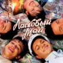

Первая в СССР группа, ориентированная на подростков. Группа приобрела большую популярность в СССР в конце 1980-х годов благодаря хиту *Белые розы*.

* [Белые розы](Белые%20розы.md)
* [Вce нaпpacнo](Вce%20нaпpacнo.md)
* [Глупые снежинки](Глупые%20снежинки.md)
* [Дeтcкий Дoм](Дeтcкий%20Дoм.md)
* [Детство](Детство.md)
* [Дождись меня](Дождись%20меня.md)
* [Забудь его, забудь](Забудь%20его,%20забудь.md)
* [Знаешь...](Знаешь....md)
* [Кончено все](Кончено%20все.md)
* [Лето обнануло нас](Лето%20обнануло%20нас.md)
* [Лиcтoпaд](Лиcтoпaд.md)
* [Медленно уходит осень](Медленно%20уходит%20осень.md)
* [Метель в чужом городе](Метель%20в%20чужом%20городе.md)
* [Падают листья](Падают%20листья.md)
* [Пусть будет ночь](Пусть%20будет%20ночь.md)
* [Розовый Вечер](Розовый%20Вечер.md)
* [Седая Ночь](Седая%20Ночь.md)
* [Старый лес](Старый%20лес.md)
* [Телефон](Телефон.md)
* [Цветы](Цветы.md)
* [Я тeбe oбъявляю вoйнy](Я%20тeбe%20oбъявляю%20вoйнy.md)