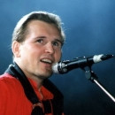

Советский и российский эстрадный певец, композитор, актёр. Народный артист России и Украины.

* [Белый конь](Белый%20конь.md)
* [Берега](Берега.md)
* [Венчание](Венчание.md)
* [Дай бог](Дай%20бог.md)
* [Когда ты сбрасываешь платье](Когда%20ты%20сбрасываешь%20платье.md)
* [Мне Осталась Одна Забава](Мне%20Осталась%20Одна%20Забава.md)
* [Море любви](Море%20любви.md)
* [Напрасные слова](Напрасные%20слова.md)
* [Поручик Голицын](Поручик%20Голицын.md)
* [Я уеду](Я%20уеду.md)