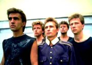

Советская и российская рок-группа, основанная в Свердловске в 1983 году Вячеславом Бутусовым и Дмитрием Умецким.

* [20 000](20%20000.md)
* [20000](20000.md)
* [9-й скотч](9-й%20скотч.md)
* [Абсолютное белое](Абсолютное%20белое.md)
* [Автор](Автор.md)
* [Алчи, Алчи](Алчи,%20Алчи.md)
* [Алчи-Алчи](Алчи-Алчи.md)
* [Америка](Америка.md)
* [Анабассис](Анабассис.md)
* [Апельсиновый день](Апельсиновый%20день.md)
* [Атлантида](Атлантида.md)
* [Бегущая вдаль](Бегущая%20вдаль.md)
* [Бедная птица](Бедная%20птица.md)
* [Беззаботная лень](Беззаботная%20лень.md)
* [Белая стена](Белая%20стена.md)
* [Берег](Берег.md)
* [Бесы](Бесы.md)
* [Бибигон-2](Бибигон-2.md)
* [Битва с магнатом](Битва%20с%20магнатом.md)
* [Боксер](Боксер.md)
* [Большое сердце](Большое%20сердце.md)
* [Бриллиантовые дороги](Бриллиантовые%20дороги.md)
* [Буги с косой](Буги%20с%20косой.md)
* [В итальянской опере](В%20итальянской%20опере.md)
* [В который раз я вижу R'N'R](В%20который%20раз%20я%20вижу%20R'N'R.md)
* [В.С.О.С.](В.С.О.С..md)
* [Венеpа](Венеpа.md)
* [Венера](Венера.md)
* [Вертолёт](Вертолёт.md)
* [Взгляд с экрана (Ален Делон)](Взгляд%20с%20экрана%20(Ален%20Делон).md)
* [Взгляд с экрана](Взгляд%20с%20экрана.md)
* [Во время дождя](Во%20время%20дождя.md)
* [Воздух](Воздух.md)
* [Возьмите мое золото](Возьмите%20мое%20золото.md)
* [Ворота, откуда я вышел](Ворота,%20откуда%20я%20вышел.md)
* [Все кто нес](Все%20кто%20нес.md)
* [Все, кто нес](Все,%20кто%20нес.md)
* [Всего лишь быть](Всего%20лишь%20быть.md)
* [Гибралтар - Лабрадор](Гибралтар%20-%20Лабрадор.md)
* [Гибралтар-Лабрадор](Гибралтар-Лабрадор.md)
* [Город братской любви](Город%20братской%20любви.md)
* [Гороховые зерна](Гороховые%20зерна.md)
* [Гуд-бай, Америка](Гуд-бай,%20Америка.md)
* [Джульеттa](Джульеттa.md)
* [Джульетта](Джульетта.md)
* [Доктор Твоего Тела](Доктор%20Твоего%20Тела.md)
* [Дыхание](Дыхание.md)
* [Жажда](Жажда.md)
* [Железнодорожник](Железнодорожник.md)
* [Живая вода](Живая%20вода.md)
* [Заноза](Заноза.md)
* [Звезда поэта](Звезда%20поэта.md)
* [Звездочка](Звездочка.md)
* [Зверь](Зверь.md)
* [Звёздные мальчики](Звёздные%20мальчики.md)
* [Золотое пятно](Золотое%20пятно.md)
* [Иван человеков](Иван%20человеков.md)
* [Идиллия](Идиллия.md)
* [К Элоизе](К%20Элоизе.md)
* [Казанова](Казанова.md)
* [Квадратные глаза](Квадратные%20глаза.md)
* [Клетка](Клетка.md)
* [Князь тишины](Князь%20тишины.md)
* [Колеса любви](Колеса%20любви.md)
* [Конь](Конь.md)
* [Красные листья](Красные%20листья.md)
* [Крылья](Крылья.md)
* [Кто еще](Кто%20еще.md)
* [Кто ещё...](Кто%20ещё....md)
* [Кто я](Кто%20я.md)
* [Летучая мышь](Летучая%20мышь.md)
* [Летучий Фрегат](Летучий%20Фрегат.md)
* [Люди на холме](Люди%20на%20холме.md)
* [Люди](Люди.md)
* [Маленький подвиг](Маленький%20подвиг.md)
* [Мальчик-зима](Мальчик-зима.md)
* [Матерь богов](Матерь%20богов.md)
* [Мифическая столовая](Мифическая%20столовая.md)
* [Мой брат Каин](Мой%20брат%20Каин.md)
* [Монгольская степь](Монгольская%20степь.md)
* [Морской Змей](Морской%20Змей.md)
* [Музыка на песке](Музыка%20на%20песке.md)
* [Музыка](Музыка.md)
* [На берегу безымянной реки](На%20берегу%20безымянной%20реки.md)
* [На берегу тихой реки](На%20берегу%20тихой%20реки.md)
* [На берегу](На%20берегу.md)
* [Настасья](Настасья.md)
* [Наша семья](Наша%20семья.md)
* [Небо и трава](Небо%20и%20трава.md)
* [Негодяй и Ангел](Негодяй%20и%20Ангел.md)
* [Нежный вампир](Нежный%20вампир.md)
* [Непорочное зачатие](Непорочное%20зачатие.md)
* [Никомуникабельность](Никомуникабельность.md)
* [Никто мне не поверит](Никто%20мне%20не%20поверит.md)
* [Одинокая птица](Одинокая%20птица.md)
* [Она ждёт любви](Она%20ждёт%20любви.md)
* [Отход на Север](Отход%20на%20Север.md)
* [Падал тёплый снег](Падал%20тёплый%20снег.md)
* [Падший ангел](Падший%20ангел.md)
* [Песня в защиту женщин](Песня%20в%20защиту%20женщин.md)
* [Песня в защиту мужчин](Песня%20в%20защиту%20мужчин.md)
* [Песня о песне](Песня%20о%20песне.md)
* [Пессимистия](Пессимистия.md)
* [Пингвинья ревность](Пингвинья%20ревность.md)
* [После и снова](После%20и%20снова.md)
* [Последнее письмо](Последнее%20письмо.md)
* [Последний человек на Земле](Последний%20человек%20на%20Земле.md)
* [Праздник общей беды](Праздник%20общей%20беды.md)
* [Превращение](Превращение.md)
* [Прогулки по воде](Прогулки%20по%20воде.md)
* [Прощальное письмо](Прощальное%20письмо.md)
* [Путь](Путь.md)
* [Разлука](Разлука.md)
* [Рвать ткань](Рвать%20ткань.md)
* [Родившийся в эту ночь](Родившийся%20в%20эту%20ночь.md)
* [Русский рок](Русский%20рок.md)
* [Свидание](Свидание.md)
* [Сестры печали](Сестры%20печали.md)
* [Синоптики](Синоптики.md)
* [Скважина](Скважина.md)
* [Скованные одной цепью](Скованные%20одной%20цепью.md)
* [Странники в ночи](Странники%20в%20ночи.md)
* [Стриптиз](Стриптиз.md)
* [Титаник](Титаник.md)
* [Тихие игры](Тихие%20игры.md)
* [Три поросера](Три%20поросера.md)
* [Три царя](Три%20царя.md)
* [Труби, Гавриил](Труби,%20Гавриил.md)
* [Тутанхамон](Тутанхамон.md)
* [Умершие во сне](Умершие%20во%20сне.md)
* [Утро Полины](Утро%20Полины.md)
* [Фанта-джюс](Фанта-джюс.md)
* [Хлоп Хлоп](Хлоп%20Хлоп.md)
* [Хлоп-Хлоп](Хлоп-Хлоп.md)
* [Христос (Мне снилось что...)](Христос%20(Мне%20снилось%20что...).md)
* [Человек На Луне](Человек%20На%20Луне.md)
* [Человек без имени](Человек%20без%20имени.md)
* [Черные птицы](Черные%20птицы.md)
* [Чистый бес](Чистый%20бес.md)
* [Чугада](Чугада.md)
* [Чужая земля](Чужая%20земля.md)
* [Чужой](Чужой.md)
* [Шар цвета хаки](Шар%20цвета%20хаки.md)
* [Шар цвета хакки](Шар%20цвета%20хакки.md)
* [Эпиграф](Эпиграф.md)
* [Эта Музыка Будет вечной](Эта%20Музыка%20Будет%20вечной.md)
* [Эти реки](Эти%20реки.md)
* [Я не вернусь](Я%20не%20вернусь.md)
* [Я хочу быть с тобой](Я%20хочу%20быть%20с%20тобой.md)
* [Ястребиная свадьба](Ястребиная%20свадьба.md)