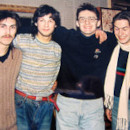

Советская и российская рок-группа, была основана певцом-баянистом Фёдором «Дядя Фёдор» Чистяковым вместе с барабанщиком Алексеем «Николс» Николаевым и Анатолием Платоновым в Ленинграде осенью 1985 года.

* [90 градусов ниже нуля](90%20градусов%20ниже%20нуля.md)
* [Аборт](Аборт.md)
* [Барыня](Барыня.md)
* [Безобразия](Безобразия.md)
* [Блуждающий биоробот №2](Блуждающий%20биоробот%20№2.md)
* [Блуждающий биоробот](Блуждающий%20биоробот.md)
* [Буги-вуги каждый день](Буги-вуги%20каждый%20день.md)
* [Будет всё хорошо](Будет%20всё%20хорошо.md)
* [В саду у дяди Миши](В%20саду%20у%20дяди%20Миши.md)
* [Верещагин](Верещагин.md)
* [Вперёд, болты](Вперёд,%20болты.md)
* [Все будет хорошо](Все%20будет%20хорошо.md)
* [Вставай](Вставай.md)
* [Гадюка](Гадюка.md)
* [Говнорок](Говнорок.md)
* [Год Козла](Год%20Козла.md)
* [Гони тараканов (2 вариант)](Гони%20тараканов%20(2%20вариант).md)
* [Гони тараканов](Гони%20тараканов.md)
* [Граница, стоять](Граница,%20стоять.md)
* [День большой осы](День%20большой%20осы.md)
* [Деньги](Деньги.md)
* [Доктор Хайдер](Доктор%20Хайдер.md)
* [Ехали по улицам трамваи...](Ехали%20по%20улицам%20трамваи....md)
* [Ехали по улицам трамваи](Ехали%20по%20улицам%20трамваи.md)
* [Жизнь](Жизнь.md)
* [Журавель](Журавель.md)
* [Завтра будет тот же день](Завтра%20будет%20тот%20же%20день.md)
* [Игра в любовь](Игра%20в%20любовь.md)
* [Иду курю](Иду%20курю.md)
* [Иду, курю](Иду,%20курю.md)
* [Имя моё](Имя%20моё.md)
* [Имя](Имя.md)
* [Инвалид нулевой группы](Инвалид%20нулевой%20группы.md)
* [Как оно есть](Как%20оно%20есть.md)
* [Кислотный дождь](Кислотный%20дождь.md)
* [Когда проснется Бах](Когда%20проснется%20Бах.md)
* [Когда проснётся Бах](Когда%20проснётся%20Бах.md)
* [Кожаный соловей](Кожаный%20соловей.md)
* [Коммунальные квартиры](Коммунальные%20квартиры.md)
* [Лица](Лица.md)
* [Любовь ушла](Любовь%20ушла.md)
* [Любовь](Любовь.md)
* [Лёгкая эротика](Лёгкая%20эротика.md)
* [Мажорище](Мажорище.md)
* [Марш энтузиастов II](Марш%20энтузиастов%20II.md)
* [Мнe нe мecтo в этoм миpe](Мнe%20нe%20мecтo%20в%20этoм%20миpe.md)
* [Мне не место в этом мире](Мне%20не%20место%20в%20этом%20мире.md)
* [Море](Море.md)
* [Московский вокзал](Московский%20вокзал.md)
* [Музыка драчёвых напильников](Музыка%20драчёвых%20напильников.md)
* [Мухи](Мухи.md)
* [Мы будем тут](Мы%20будем%20тут.md)
* [Мы идём пить квас](Мы%20идём%20пить%20квас.md)
* [На 90 градусов ниже нуля](На%2090%20градусов%20ниже%20нуля.md)
* [Нам дан старт](Нам%20дан%20старт.md)
* [Наш день](Наш%20день.md)
* [Наши лица](Наши%20лица.md)
* [Осень](Осень.md)
* [Песня о настоящем индейце](Песня%20о%20настоящем%20индейце.md)
* [Песня про НАСТОЯЩЕГО индейца (2 вариант)](Песня%20про%20НАСТОЯЩЕГО%20индейца%20(2%20вариант).md)
* [Песня про НАСТОЯЩЕГО индейца](Песня%20про%20НАСТОЯЩЕГО%20индейца.md)
* [Прости, что не верил](Прости,%20что%20не%20верил.md)
* [Просто я живу на улице Ленина...](Просто%20я%20живу%20на%20улице%20Ленина....md)
* [Пушки - в зад](Пушки%20-%20в%20зад.md)
* [Радио Любитель](Радио%20Любитель.md)
* [Русская экологическая (2 вариант)](Русская%20экологическая%20(2%20вариант).md)
* [Русская экологическая](Русская%20экологическая.md)
* [СПИД](СПИД.md)
* [Самолет](Самолет.md)
* [Самцы и самки](Самцы%20и%20самки.md)
* [Северное буги](Северное%20буги.md)
* [Сказка о колбасе](Сказка%20о%20колбасе.md)
* [Сказка про колбаску](Сказка%20про%20колбаску.md)
* [Танго (быль)](Танго%20(быль).md)
* [Трамваи](Трамваи.md)
* [Ты - тормоз](Ты%20-%20тормоз.md)
* [Тёмная ночь](Тёмная%20ночь.md)
* [Улица Ленина](Улица%20Ленина.md)
* [Цикорий](Цикорий.md)
* [Человек и Кошка (2 вариант)](Человек%20и%20Кошка%20(2%20вариант).md)
* [Человек и Кошка](Человек%20и%20Кошка.md)
* [Что так сердце растревожено](Что%20так%20сердце%20растревожено.md)
* [Школа жизни (2 вариант)](Школа%20жизни%20(2%20вариант).md)
* [Школа жизни](Школа%20жизни.md)
* [Э.Т.О.Я.Л.Ю.Б.Л.Ю.Т.Е.Б.Я.](Э.Т.О.Я.Л.Ю.Б.Л.Ю.Т.Е.Б.Я..md)
* [Этот русский Rock-n-roll](Этот%20русский%20Rock-n-roll.md)
* [Я - самолет](Я%20-%20самолет.md)
* [Я - самолёт](Я%20-%20самолёт.md)
* [Я проиграл](Я%20проиграл.md)
* [Я уже человек](Я%20уже%20человек.md)
* [Я.Л.Ю.Б.Л.Ю.Т.Е.Б.Я.](Я.Л.Ю.Б.Л.Ю.Т.Е.Б.Я..md)