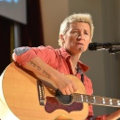

Рок-группа из Санкт-Петербурга. Основатель и лидер Диана Арбенина.

* [22 часа разлуки](22%20часа%20разлуки.md)
* [31-я весна](31-я%20весна.md)
* [9 с половиной](9%20с%20половиной.md)
* [Dance Me](Dance%20Me.md)
* [Jazz](Jazz.md)
* [Liest Viel](Liest%20Viel.md)
* [SMS](SMS.md)
* [А дочь моя боится темноты...](А%20дочь%20моя%20боится%20темноты....md)
* [А что-то прожито и что-то понято...](А%20что-то%20прожито%20и%20что-то%20понято....md)
* [Аfрики](Аfрики.md)
* [Абсолютный сталевар](Абсолютный%20сталевар.md)
* [Автобус с чёрной полосой](Автобус%20с%20чёрной%20полосой.md)
* [Автомобильный блюз](Автомобильный%20блюз.md)
* [Актриса](Актриса.md)
* [Алмазный Британец](Алмазный%20Британец.md)
* [Ангел седой](Ангел%20седой.md)
* [Ангел №2](Ангел%20№2.md)
* [Апрельская](Апрельская.md)
* [Асфальт](Асфальт.md)
* [Б2](Б2.md)
* [Бабушки](Бабушки.md)
* [Барабанщик](Барабанщик.md)
* [Беда](Беда.md)
* [Белая песня](Белая%20песня.md)
* [Белые козы](Белые%20козы.md)
* [Белые люди](Белые%20люди.md)
* [Благодарю](Благодарю.md)
* [Блины по-снайперски](Блины%20по-снайперски.md)
* [Блюзы гор](Блюзы%20гор.md)
* [Больно](Больно.md)
* [Бу-бу](Бу-бу.md)
* [Бумерангом](Бумерангом.md)
* [Бутылки](Бутылки.md)
* [Была мечта](Была%20мечта.md)
* [В доме плачут свечи](В%20доме%20плачут%20свечи.md)
* [В игольное ушко...](В%20игольное%20ушко....md)
* [В этом городе ф.](В%20этом%20городе%20ф..md)
* [Весна](Весна.md)
* [Ветер и ночь](Ветер%20и%20ночь.md)
* [Вечер в Крыму](Вечер%20в%20Крыму.md)
* [Влажный блеск наших глаз](Влажный%20блеск%20наших%20глаз.md)
* [Внезапно](Внезапно.md)
* [Вокзал](Вокзал.md)
* [Ворон](Ворон.md)
* [Вороны ложатся спать...](Вороны%20ложатся%20спать....md)
* [Вот и все мои песенки](Вот%20и%20все%20мои%20песенки.md)
* [Вот так, нескладно...](Вот%20так,%20нескладно....md)
* [Враз украденные лица...](Враз%20украденные%20лица....md)
* [Время года зима](Время%20года%20зима.md)
* [Время, о тебе я вновь пою](Время,%20о%20тебе%20я%20вновь%20пою.md)
* [Время, о тебе я напою](Время,%20о%20тебе%20я%20напою.md)
* [Всегда](Всегда.md)
* [Всё случилось не с тобой...](Всё%20случилось%20не%20с%20тобой....md)
* [Где ты](Где%20ты.md)
* [Где-то там высоко](Где-то%20там%20высоко.md)
* [Голубой слон](Голубой%20слон.md)
* [Гонщик](Гонщик.md)
* [Горе по небу шагает](Горе%20по%20небу%20шагает.md)
* [Города](Города.md)
* [Гости мои](Гости%20мои.md)
* [Грязные танцы](Грязные%20танцы.md)
* [Д.р.](Д.р..md)
* [Да, да, да](Да,%20да,%20да.md)
* [Давно не виделись - здравствуй](Давно%20не%20виделись%20-%20здравствуй.md)
* [Директорская](Директорская.md)
* [До востребования](До%20востребования.md)
* [Добрый вечер](Добрый%20вечер.md)
* [Дождик (Кап-кап)](Дождик%20(Кап-кап).md)
* [Дождь в пустыне](Дождь%20в%20пустыне.md)
* [Дождь](Дождь.md)
* [Доктор](Доктор.md)
* [Друг для друга](Друг%20для%20друга.md)
* [Душа как...](Душа%20как....md)
* [Ежик](Ежик.md)
* [Если б во мне были слезы...](Если%20б%20во%20мне%20были%20слезы....md)
* [Жанетте (Назло фортуне)](Жанетте%20(Назло%20фортуне).md)
* [Желание](Желание.md)
* [Забудь о том, что было](Забудь%20о%20том,%20что%20было.md)
* [Завоюй меня](Завоюй%20меня.md)
* [Зву-чи](Зву-чи.md)
* [Звучи](Звучи.md)
* [Здание красят](Здание%20красят.md)
* [Зовёт дорога](Зовёт%20дорога.md)
* [Иду одна](Иду%20одна.md)
* [Имя твоё (В небе полном звёзд)](Имя%20твоё%20(В%20небе%20полном%20звёзд).md)
* [Каждый дышит](Каждый%20дышит.md)
* [Как же я был глух...](Как%20же%20я%20был%20глух....md)
* [Катастрофически](Катастрофически.md)
* [Католический священник](Католический%20священник.md)
* [Ко мне ангел](Ко%20мне%20ангел.md)
* [Когда горит свет](Когда%20горит%20свет.md)
* [Когда устанешь](Когда%20устанешь.md)
* [Колыбельная по-снайперски](Колыбельная%20по-снайперски.md)
* [Коммунальный рок-н-ролл](Коммунальный%20рок-н-ролл.md)
* [Корабли](Корабли.md)
* [Кошка московская](Кошка%20московская.md)
* [Кошка](Кошка.md)
* [Куба](Куба.md)
* [Кубинский песок](Кубинский%20песок.md)
* [Лето 93-го](Лето%2093-го.md)
* [Лето-пиво](Лето-пиво.md)
* [Лето](Лето.md)
* [Лист филь](Лист%20филь.md)
* [Мальчики-солдаты](Мальчики-солдаты.md)
* [Милая девочка](Милая%20девочка.md)
* [Мне нравится](Мне%20нравится.md)
* [Мне с тобой не ходить](Мне%20с%20тобой%20не%20ходить.md)
* [Мой маленький рыжий](Мой%20маленький%20рыжий.md)
* [Молитва мольберту](Молитва%20мольберту.md)
* [Мольберт](Мольберт.md)
* [Москва-Питер-Москва](Москва-Питер-Москва.md)
* [Мрачная тема](Мрачная%20тема.md)
* [Музыка](Музыка.md)
* [Мураками](Мураками.md)
* [Мы едем домой](Мы%20едем%20домой.md)
* [Мы столько лет...](Мы%20столько%20лет....md)
* [На границе](На%20границе.md)
* [Нас единицы](Нас%20единицы.md)
* [Не бойся, милая...](Не%20бойся,%20милая....md)
* [Не горюй](Не%20горюй.md)
* [Не ищу](Не%20ищу.md)
* [Не прав, кто мир наш окрестил...](Не%20прав,%20кто%20мир%20наш%20окрестил....md)
* [Не тобой болеет сердце](Не%20тобой%20болеет%20сердце.md)
* [Небо](Небо.md)
* [Неужели не я](Неужели%20не%20я.md)
* [Ничего не происходит](Ничего%20не%20происходит.md)
* [Ночной курьерский](Ночной%20курьерский.md)
* [Ночь](Ночь.md)
* [Ну вот и всё...](Ну%20вот%20и%20всё....md)
* [О тебе не поют](О%20тебе%20не%20поют.md)
* [О, Любимая](О,%20Любимая.md)
* [Обещанный снег](Обещанный%20снег.md)
* [Ограда (Ты уйдёшь)](Ограда%20(Ты%20уйдёшь).md)
* [Один поцелуй моряка](Один%20поцелуй%20моряка.md)
* [Она (Я знаю женщину)](Она%20(Я%20знаю%20женщину).md)
* [Она (Я знаю женщину...)](Она%20(Я%20знаю%20женщину...).md)
* [Она выпускает змей](Она%20выпускает%20змей.md)
* [Она ничем не знаменита...](Она%20ничем%20не%20знаменита....md)
* [Она](Она.md)
* [Они убили тебя](Они%20убили%20тебя.md)
* [Опасное лето](Опасное%20лето.md)
* [Осень ну и что](Осень%20ну%20и%20что.md)
* [Оставь](Оставь.md)
* [Остывающий день](Остывающий%20день.md)
* [Офицерская жена](Офицерская%20жена.md)
* [Охота на волчат](Охота%20на%20волчат.md)
* [Падаешь в небо](Падаешь%20в%20небо.md)
* [Папа](Папа.md)
* [Париж](Париж.md)
* [Пароходы](Пароходы.md)
* [Парфюмерная](Парфюмерная.md)
* [Песня для Кейва](Песня%20для%20Кейва.md)
* [Песня юнкера](Песня%20юнкера.md)
* [Питерская](Питерская.md)
* [По волнам твоих слез](По%20волнам%20твоих%20слез.md)
* [По волнам твоих слёз](По%20волнам%20твоих%20слёз.md)
* [По дороге](По%20дороге.md)
* [По твоей земле](По%20твоей%20земле.md)
* [Полетели](Полетели.md)
* [Полчаса](Полчаса.md)
* [Пороховая](Пороховая.md)
* [Последняя ночь накануне столетней войны](Последняя%20ночь%20накануне%20столетней%20войны.md)
* [Почему мне иногда так одиноко](Почему%20мне%20иногда%20так%20одиноко.md)
* [Почему я не вижу здесь кораблей](Почему%20я%20не%20вижу%20здесь%20кораблей.md)
* [Предчувствие смерти](Предчувствие%20смерти.md)
* [Придёт письмо](Придёт%20письмо.md)
* [Просто кончился мёд](Просто%20кончился%20мёд.md)
* [Птица певчая](Птица%20певчая.md)
* [Птицы](Птицы.md)
* [Пулемётом по звёздам](Пулемётом%20по%20звёздам.md)
* [Путник милый](Путник%20милый.md)
* [Путник](Путник.md)
* [Пух](Пух.md)
* [Расстреляли нежность](Расстреляли%20нежность.md)
* [Реггeй](Реггeй.md)
* [Редкая птица](Редкая%20птица.md)
* [Ремень](Ремень.md)
* [Романс №4](Романс%20№4.md)
* [Россия, 37](Россия,%2037.md)
* [Рубеж (2 вариант)](Рубеж%20(2%20вариант).md)
* [Рубеж](Рубеж.md)
* [Рулетка](Рулетка.md)
* [Русский пассажир](Русский%20пассажир.md)
* [Рыжая девчонка](Рыжая%20девчонка.md)
* [Рэгги одиночки](Рэгги%20одиночки.md)
* [Рядом с тобой](Рядом%20с%20тобой.md)
* [Свобода](Свобода.md)
* [Сенбернары](Сенбернары.md)
* [Сказка](Сказка.md)
* [След](След.md)
* [Солнце погасло](Солнце%20погасло.md)
* [Солнце](Солнце.md)
* [Сохрани мою тень](Сохрани%20мою%20тень.md)
* [Спокойной ночи](Спокойной%20ночи.md)
* [Среди огней ночного Петербурга](Среди%20огней%20ночного%20Петербурга.md)
* [Стерх и лебедь](Стерх%20и%20лебедь.md)
* [Столица](Столица.md)
* [Страха нет](Страха%20нет.md)
* [Тайна](Тайна.md)
* [Так начинался день](Так%20начинался%20день.md)
* [Тебя я в мыслях не держу](Тебя%20я%20в%20мыслях%20не%20держу.md)
* [Терпкая осень](Терпкая%20осень.md)
* [Теряю силу](Теряю%20силу.md)
* [То, что делает меня...](То,%20что%20делает%20меня....md)
* [Только на красный](Только%20на%20красный.md)
* [Только ты](Только%20ты.md)
* [Только шум на реке](Только%20шум%20на%20реке.md)
* [Тоска](Тоска.md)
* [Травы](Травы.md)
* [Тугая ночь](Тугая%20ночь.md)
* [Ты - моё дыхание](Ты%20-%20моё%20дыхание.md)
* [Ты город](Ты%20город.md)
* [Ты дарила мне розы](Ты%20дарила%20мне%20розы.md)
* [Ты навсегда](Ты%20навсегда.md)
* [Ты пламя](Ты%20пламя.md)
* [Ты тоньше](Ты%20тоньше.md)
* [Ты уйдешь](Ты%20уйдешь.md)
* [Ты](Ты.md)
* [У церкви стояла карета](У%20церкви%20стояла%20карета.md)
* [Уп-тау-ду](Уп-тау-ду.md)
* [Уставшие глаза от войны...](Уставшие%20глаза%20от%20войны....md)
* [Устроенность](Устроенность.md)
* [Утомленное солнце](Утомленное%20солнце.md)
* [Февральский ветер](Февральский%20ветер.md)
* [Холмы](Холмы.md)
* [Цунами](Цунами.md)
* [Черно-белый король](Черно-белый%20король.md)
* [Черное солнце](Черное%20солнце.md)
* [Черный табурет](Черный%20табурет.md)
* [Что на дворе](Что%20на%20дворе.md)
* [Чуть больше](Чуть%20больше.md)
* [Шаг за шагом](Шаг%20за%20шагом.md)
* [Энергетический вампир](Энергетический%20вампир.md)
* [Этот дом](Этот%20дом.md)
* [Юго 2](Юго%202.md)
* [Юго](Юго.md)
* [Я больше не ревную](Я%20больше%20не%20ревную.md)
* [Я вновь ухожу](Я%20вновь%20ухожу.md)
* [Я знаю женщину](Я%20знаю%20женщину.md)
* [Я играю в Б2](Я%20играю%20в%20Б2.md)
* [Я люблю того](Я%20люблю%20того.md)
* [Я не знаю, кто ты](Я%20не%20знаю,%20кто%20ты.md)
* [Я покидаю столицу](Я%20покидаю%20столицу.md)
* [Я раскрашивал курицу](Я%20раскрашивал%20курицу.md)
* [Я раскрашивал небо](Я%20раскрашивал%20небо.md)
* [Я сижу у окна](Я%20сижу%20у%20окна.md)
* [Я теряю тебя](Я%20теряю%20тебя.md)
* [Я хочу поскорее отсюда уйти](Я%20хочу%20поскорее%20отсюда%20уйти.md)