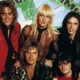

Советская, американская и российская рок-группа, выступавшая в Соединенных Штатах в конце 80-х начале 90-х годов. Классический состав группы - Александр Миньков (бас и вокал), Алексей Белов (гитара), Ян Яненков (ритм-гитара), Александр Львов (ударные). 

* [Bang](Bang.md)
* [California Promises](California%20Promises.md)
* [Moscow Calling](Moscow%20Calling.md)
* [Ocean](Ocean.md)
* [Stranger](Stranger.md)
* [Tell Me Why](Tell%20Me%20Why.md)
* [Two Candles (2 вариант)](Two%20Candles%20(2%20вариант).md)
* [Two Candles](Two%20Candles.md)
* [Беда (2 вариант)](Беда%20(2%20вариант).md)
* [Беда](Беда.md)
* [Без тебя](Без%20тебя.md)
* [Две свечи](Две%20свечи.md)