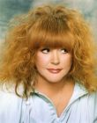

Советская и российская певица эстрады.

* [Айсберг](Айсберг.md)
* [Без меня](Без%20меня.md)
* [До свиданья, лето](До%20свиданья,%20лето.md)
* [Звездное лето](Звездное%20лето.md)
* [Куда уходит детство](Куда%20уходит%20детство.md)
* [Маэстро](Маэстро.md)
* [На Бис](На%20Бис.md)
* [Не отрекаются любя](Не%20отрекаются%20любя.md)
* [Осенний поцелуй](Осенний%20поцелуй.md)
* [Песенка про меня](Песенка%20про%20меня.md)
* [Примадонна](Примадонна.md)
* [Прости, поверь](Прости,%20поверь.md)
* [Старинные часы](Старинные%20часы.md)
* [Только не назад](Только%20не%20назад.md)
* [Это любовь](Это%20любовь.md)