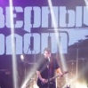

Российская рок-группа, образованная из музыкантов группы *Король и Шут* после гибели Михаила Горшенёва.  
Лидер группы Александр Леонтьев.

* [Ветер ходит налегке](Ветер%20ходит%20налегке.md)
* [Вперёд и вверх](Вперёд%20и%20вверх.md)
* [Каждую ночь](Каждую%20ночь.md)
* [Поднимая знамя](Поднимая%20знамя.md)
* [Рождённый убивать](Рождённый%20убивать.md)
* [Стрелы](Стрелы.md)
* [Харон](Харон.md)