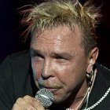

Российский рок-музыкант. Лидер группы *Неприкасаемые*.

* [10 000 километров (2 вариант)](10%20000%20километров%20(2%20вариант).md)
* [10 000 километров](10%20000%20километров.md)
* [22 июня](22%20июня.md)
* [Besame mucho](Besame%20mucho.md)
* [I Need A Needle](I%20Need%20A%20Needle.md)
* [IKEя](IKEя.md)
* [In The Death Car](In%20The%20Death%20Car.md)
* [Playboy](Playboy.md)
* [Telephone call from Istanbul](Telephone%20call%20from%20Istanbul.md)
* [Tombe La Neige](Tombe%20La%20Neige.md)
* [Tomble La Neige](Tomble%20La%20Neige.md)
* [Watch TV](Watch%20TV.md)
* [Аллергия](Аллергия.md)
* [Аргентина](Аргентина.md)
* [Ассоль](Ассоль.md)
* [Барышня и Дракон](Барышня%20и%20Дракон.md)
* [Без четверти восемь](Без%20четверти%20восемь.md)
* [Белые дороги](Белые%20дороги.md)
* [Белый колпак](Белый%20колпак.md)
* [Ботик](Ботик.md)
* [Брел, брел, брел...](Брел,%20брел,%20брел....md)
* [Бродяга](Бродяга.md)
* [Вальс Москва](Вальс%20Москва.md)
* [Витька Фомкин](Витька%20Фомкин.md)
* [Вниз по течению реки](Вниз%20по%20течению%20реки.md)
* [Всё это будет](Всё%20это%20будет.md)
* [Гибель Курска](Гибель%20Курска.md)
* [Гори, гори](Гори,%20гори.md)
* [Горит огонь](Горит%20огонь.md)
* [Города, где после дождя дымится асфальт](Города,%20где%20после%20дождя%20дымится%20асфальт.md)
* [Госпожа Удача](Госпожа%20Удача.md)
* [Грязная песня](Грязная%20песня.md)
* [Дай мне руку](Дай%20мне%20руку.md)
* [Дорога под землю](Дорога%20под%20землю.md)
* [Дорожная](Дорожная.md)
* [Дроля](Дроля.md)
* [Если ты хочешь уйти...](Если%20ты%20хочешь%20уйти....md)
* [Жил я с матерью и батей](Жил%20я%20с%20матерью%20и%20батей.md)
* [За окошком месяц май](За%20окошком%20месяц%20май.md)
* [Запретная зона](Запретная%20зона.md)
* [Звезда микрорайона](Звезда%20микрорайона.md)
* [Знаю я, есть края (2 вариант)](Знаю%20я,%20есть%20края%20(2%20вариант).md)
* [Знаю я, есть края](Знаю%20я,%20есть%20края.md)
* [Зона Z](Зона%20Z.md)
* [Иероглифы](Иероглифы.md)
* [Как пройдусь по стриту](Как%20пройдусь%20по%20стриту.md)
* [Канарейки, 9-й калибр и тромбон](Канарейки,%209-й%20калибр%20и%20тромбон.md)
* [Когда закончится последняя война](Когда%20закончится%20последняя%20война.md)
* [Когда мы покидали свой родимый край](Когда%20мы%20покидали%20свой%20родимый%20край.md)
* [Колечки](Колечки.md)
* [Коля Огонёк (Полька)](Коля%20Огонёк%20(Полька).md)
* [Кони привередливые](Кони%20привередливые.md)
* [Король проспекта](Король%20проспекта.md)
* [Красиво, когда высоко](Красиво,%20когда%20высоко.md)
* [Лейтенанты](Лейтенанты.md)
* [Летка-енька](Летка-енька.md)
* [Людоед пойман](Людоед%20пойман.md)
* [Маленькое тигровое колечко](Маленькое%20тигровое%20колечко.md)
* [Мальчишка](Мальчишка.md)
* [Месяц май](Месяц%20май.md)
* [Мишка - одессит](Мишка%20-%20одессит.md)
* [Мой друг уехал...](Мой%20друг%20уехал....md)
* [Моряк с Ордынки](Моряк%20с%20Ордынки.md)
* [Моя бабушка курит трубку](Моя%20бабушка%20курит%20трубку.md)
* [Моя бабушка](Моя%20бабушка.md)
* [На перекрестке Луны](На%20перекрестке%20Луны.md)
* [Напои меня водой](Напои%20меня%20водой.md)
* [Нас было четверо](Нас%20было%20четверо.md)
* [Не отвечай](Не%20отвечай.md)
* [Невезение](Невезение.md)
* [Нейтральная полоса](Нейтральная%20полоса.md)
* [Непокоренная вера](Непокоренная%20вера.md)
* [Нет, не красотками...](Нет,%20не%20красотками....md)
* [Ничего не надо...](Ничего%20не%20надо....md)
* [Ничего не надо](Ничего%20не%20надо.md)
* [Но все это будет...](Но%20все%20это%20будет....md)
* [Но всё это будет](Но%20всё%20это%20будет.md)
* [Нонсенс](Нонсенс.md)
* [Ночной народец](Ночной%20народец.md)
* [Ночной полет](Ночной%20полет.md)
* [Ночь после лета](Ночь%20после%20лета.md)
* [Ночь светла](Ночь%20светла.md)
* [Нулевой километр](Нулевой%20километр.md)
* [О чём поёт гитара](О%20чём%20поёт%20гитара.md)
* [Оборотень с гитарой](Оборотень%20с%20гитарой.md)
* [Оглянись](Оглянись.md)
* [Окно на окраине](Окно%20на%20окраине.md)
* [Ольга (2 вариант)](Ольга%20(2%20вариант).md)
* [Ольга](Ольга.md)
* [Он уехал в Париж](Он%20уехал%20в%20Париж.md)
* [Осень](Осень.md)
* [Перезвоны](Перезвоны.md)
* [Песенка об Арбате](Песенка%20об%20Арбате.md)
* [Песенка про Тому](Песенка%20про%20Тому.md)
* [Песенка про табак](Песенка%20про%20табак.md)
* [Песнь о любви и гармонии](Песнь%20о%20любви%20и%20гармонии.md)
* [Песня Вольного Стрелка (Белла Чао)](Песня%20Вольного%20Стрелка%20(Белла%20Чао).md)
* [Плачь](Плачь.md)
* [Плоское, как шутка...](Плоское,%20как%20шутка....md)
* [Плоское, как шутка](Плоское,%20как%20шутка.md)
* [По улице Майорова](По%20улице%20Майорова.md)
* [Полюби меня](Полюби%20меня.md)
* [Помнишь ли ночь](Помнишь%20ли%20ночь.md)
* [Помню я...](Помню%20я....md)
* [Право на выбор](Право%20на%20выбор.md)
* [Прощай, мой друг](Прощай,%20мой%20друг.md)
* [Пьяная песня](Пьяная%20песня.md)
* [Рай](Рай.md)
* [Ритка Дорофеева](Ритка%20Дорофеева.md)
* [Розовый след на белой дороге](Розовый%20след%20на%20белой%20дороге.md)
* [Самый маленький звук](Самый%20маленький%20звук.md)
* [Сантехник](Сантехник.md)
* [Свободу Анджеле Дэвис](Свободу%20Анджеле%20Дэвис.md)
* [Серенькие ежики](Серенькие%20ежики.md)
* [Сколько был я зол (Карама)](Сколько%20был%20я%20зол%20(Карама).md)
* [Скорый поезд придет в 6 часов](Скорый%20поезд%20придет%20в%206%20часов.md)
* [След тишины](След%20тишины.md)
* [Сре-тен-ка](Сре-тен-ка.md)
* [Странная птица Ло](Странная%20птица%20Ло.md)
* [Страсть](Страсть.md)
* [Счастливчик](Счастливчик.md)
* [Там, где кончается дождь](Там,%20где%20кончается%20дождь.md)
* [Татуировка](Татуировка.md)
* [Твой шепот и смех](Твой%20шепот%20и%20смех.md)
* [Телефонные парни](Телефонные%20парни.md)
* [Третья чаша](Третья%20чаша.md)
* [Трусики ''Бобо''](Трусики%20''Бобо''.md)
* [Ты больная...](Ты%20больная....md)
* [Уеду, уеду](Уеду,%20уеду.md)
* [Фантомас](Фантомас.md)
* [Хочет хоть кто-то](Хочет%20хоть%20кто-то.md)
* [Человек-привычка](Человек-привычка.md)
* [Чем пахнут твои деньги](Чем%20пахнут%20твои%20деньги.md)
* [Черная весна](Черная%20весна.md)
* [Что за жизнь ...](Что%20за%20жизнь%20....md)
* [Что за жизнь... (цыганочка)](Что%20за%20жизнь...%20(цыганочка).md)
* [Шейк](Шейк.md)
* [Шумный город](Шумный%20город.md)
* [Эй, брат, здравствуй](Эй,%20брат,%20здравствуй.md)
* [Эй, мама, я погиб на войне](Эй,%20мама,%20я%20погиб%20на%20войне.md)
* [Эксгибиционист](Эксгибиционист.md)
* [Эрегированный](Эрегированный.md)
* [Это был ангел](Это%20был%20ангел.md)
* [Я закрываю глаза](Я%20закрываю%20глаза.md)
* [Я милого узнаю по походке (2 вариант)](Я%20милого%20узнаю%20по%20походке%20(2%20вариант).md)
* [Я милого узнаю по походке](Я%20милого%20узнаю%20по%20походке.md)
* [Я обожаю JAZZ](Я%20обожаю%20JAZZ.md)
* [Я так хочу](Я%20так%20хочу.md)
* [Ямщик, поворачивай к черту](Ямщик,%20поворачивай%20к%20черту.md)
* [Янки Додсон](Янки%20Додсон.md)