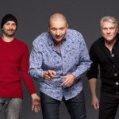

Советская и российская рок-группа, основанная в 1987 году Александром Минаевым и Павлом Молчановым. Группа позиционирует себя как ансамбль мотологической музыки.

* [Look](Look.md)
* [Rock-Women](Rock-Women.md)
* [Taxi](Taxi.md)
* [Автономное питание](Автономное%20питание.md)
* [Альпинист-водолаз](Альпинист-водолаз.md)
* [Башня](Башня.md)
* [Блинчики со сметаной](Блинчики%20со%20сметаной.md)
* [Брелок](Брелок.md)
* [Будет еще круче](Будет%20еще%20круче.md)
* [Буратино](Буратино.md)
* [Весна](Весна.md)
* [Ветер дальних стран](Ветер%20дальних%20стран.md)
* [Возьми мое сердце](Возьми%20мое%20сердце.md)
* [Вот моё весло](Вот%20моё%20весло.md)
* [Время полночных снов](Время%20полночных%20снов.md)
* [Где мои винтики](Где%20мои%20винтики.md)
* [Голос](Голос.md)
* [Дай мне уйти](Дай%20мне%20уйти.md)
* [Два года (Памяти П.Ж.)](Два%20года%20(Памяти%20П.Ж.).md)
* [Дуся](Дуся.md)
* [Дым](Дым.md)
* [Ехан Палыч](Ехан%20Палыч.md)
* [Желтые качели](Желтые%20качели.md)
* [Желтые рыббы](Желтые%20рыббы.md)
* [Жертвы научной фантастики](Жертвы%20научной%20фантастики.md)
* [Иду по краю](Иду%20по%20краю.md)
* [Как прожить без зла](Как%20прожить%20без%20зла.md)
* [Кантри](Кантри.md)
* [Клоуны](Клоуны.md)
* [Коммерческий вальс](Коммерческий%20вальс.md)
* [Коровье вымя](Коровье%20вымя.md)
* [Люди как люди](Люди%20как%20люди.md)
* [Лётчик](Лётчик.md)
* [Маразматические догоныыы](Маразматические%20догоныыы.md)
* [Милая ночь](Милая%20ночь.md)
* [Мир афиш, витрин](Мир%20афиш,%20витрин.md)
* [Монгольское море](Монгольское%20море.md)
* [Мрачная песня](Мрачная%20песня.md)
* [Начало](Начало.md)
* [Не зови](Не%20зови.md)
* [Не тормози](Не%20тормози.md)
* [Ненавижу](Ненавижу.md)
* [Никто меня не любит](Никто%20меня%20не%20любит.md)
* [Новогодняя](Новогодняя.md)
* [Ода мне](Ода%20мне.md)
* [Океан](Океан.md)
* [Осень](Осень.md)
* [Осколки зла](Осколки%20зла.md)
* [Пpo Нaвoз](Пpo%20Нaвoз.md)
* [Песня Сухэ-Батора](Песня%20Сухэ-Батора.md)
* [Песня карточного короля](Песня%20карточного%20короля.md)
* [Песня про ежа](Песня%20про%20ежа.md)
* [Песня про навоз](Песня%20про%20навоз.md)
* [Песня про яму](Песня%20про%20яму.md)
* [Плюц про цацета](Плюц%20про%20цацета.md)
* [По барабану](По%20барабану.md)
* [Предательская песня](Предательская%20песня.md)
* [Про лысых](Про%20лысых.md)
* [Про навоз](Про%20навоз.md)
* [Про пиво](Про%20пиво.md)
* [Пружина дней](Пружина%20дней.md)
* [Пьяная песня](Пьяная%20песня.md)
* [Романс](Романс.md)
* [Рыббацко-охотничья](Рыббацко-охотничья.md)
* [Самолёт](Самолёт.md)
* [Самый лучший день](Самый%20лучший%20день.md)
* [Саша, я хочу стать космонавтом](Саша,%20я%20хочу%20стать%20космонавтом.md)
* [Сосулька](Сосулька.md)
* [Страданья](Страданья.md)
* [Судьба](Судьба.md)
* [Сумочка-нора](Сумочка-нора.md)
* [Только вдвоём](Только%20вдвоём.md)
* [Флаг кораблю](Флаг%20кораблю.md)
* [Человек-амфибия](Человек-амфибия.md)
* [Шигидарупупай](Шигидарупупай.md)
* [Шире шаг](Шире%20шаг.md)
* [Школьница](Школьница.md)
* [Я люблю кататься](Я%20люблю%20кататься.md)
* [Я с тобой](Я%20с%20тобой.md)
* [Яблочко](Яблочко.md)