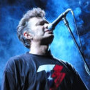

Советская и российская рок-группа из Ленинграда, сочетающая тяжелую электронную музыку с мрачными текстами.

* [Dooma](Dooma.md)
* [Ада нет](Ада%20нет.md)
* [Акварель](Акварель.md)
* [Алла Борисна](Алла%20Борисна.md)
* [Аллилуйя](Аллилуйя.md)
* [Бабуины](Бабуины.md)
* [Беги-беги](Беги-беги.md)
* [Без сахара](Без%20сахара.md)
* [Белый лебедь](Белый%20лебедь.md)
* [Быть бы](Быть%20бы.md)
* [Вера](Вера.md)
* [Внутри](Внутри.md)
* [Всё в порядке](Всё%20в%20порядке.md)
* [Вчера](Вчера.md)
* [Выйти из-под контроля](Выйти%20из-под%20контроля.md)
* [Город](Город.md)
* [Гости](Гости.md)
* [Дальний Восток](Дальний%20Восток.md)
* [День Михаила](День%20Михаила.md)
* [Дети уходят](Дети%20уходят.md)
* [До-Мажор](До-Мажор.md)
* [Душа](Душа.md)
* [Дым-туман](Дым-туман.md)
* [Дым](Дым.md)
* [Если телефон молчит](Если%20телефон%20молчит.md)
* [Завтра](Завтра.md)
* [Звёздная](Звёздная.md)
* [Когда ты умрёшь](Когда%20ты%20умрёшь.md)
* [Кожа апельсинья](Кожа%20апельсинья.md)
* [Конца света не будет](Конца%20света%20не%20будет.md)
* [Костыли](Костыли.md)
* [Кто ты](Кто%20ты.md)
* [Лают](Лают.md)
* [Листик](Листик.md)
* [Люди в ожидании](Люди%20в%20ожидании.md)
* [Люли-люли](Люли-люли.md)
* [Мандариновый снег](Мандариновый%20снег.md)
* [Мания величия](Мания%20величия.md)
* [Мегамизантроп](Мегамизантроп.md)
* [Мечта самоубийцы](Мечта%20самоубийцы.md)
* [Молча](Молча.md)
* [Музыка для мёртвых](Музыка%20для%20мёртвых.md)
* [Муха на стекле](Муха%20на%20стекле.md)
* [Муха-блюз](Муха-блюз.md)
* [Мы идём](Мы%20идём.md)
* [Мы не хотим быть мишенями](Мы%20не%20хотим%20быть%20мишенями.md)
* [На Желябова, 13](На%20Желябова,%2013.md)
* [Не в себе](Не%20в%20себе.md)
* [Не плачь](Не%20плачь.md)
* [Негодяй](Негодяй.md)
* [Нет денег](Нет%20денег.md)
* [Никому не нужен](Никому%20не%20нужен.md)
* [Обо мне](Обо%20мне.md)
* [Обходи](Обходи.md)
* [Огнетушитель](Огнетушитель.md)
* [Отечество иллюзий](Отечество%20иллюзий.md)
* [Отчуждение](Отчуждение.md)
* [Палец](Палец.md)
* [Пластмасса](Пластмасса.md)
* [Политпесня](Политпесня.md)
* [Полночный человек](Полночный%20человек.md)
* [Полуфабрикаты](Полуфабрикаты.md)
* [Послушай, я вчера](Послушай,%20я%20вчера.md)
* [Потребитель](Потребитель.md)
* [Пронесло](Пронесло.md)
* [Пустой](Пустой.md)
* [Путь к успеху](Путь%20к%20успеху.md)
* [Рыба гниёт с головы](Рыба%20гниёт%20с%20головы.md)
* [С вами говорит телевизор](С%20вами%20говорит%20телевизор.md)
* [Случайно](Случайно.md)
* [Сыт по горло](Сыт%20по%20горло.md)
* [Танго](Танго.md)
* [Тараканы](Тараканы.md)
* [Твой папа - фашист](Твой%20папа%20-%20фашист.md)
* [Тепло](Тепло.md)
* [Товарищ Сухов](Товарищ%20Сухов.md)
* [Три-четыре гада](Три-четыре%20гада.md)
* [Ты на пути в Чикаго](Ты%20на%20пути%20в%20Чикаго.md)
* [Укатала](Укатала.md)
* [Унижение](Унижение.md)
* [Уходи один](Уходи%20один.md)
* [Ушла из дома](Ушла%20из%20дома.md)
* [Холод](Холод.md)
* [Цветные сны](Цветные%20сны.md)
* [Человек из ваты](Человек%20из%20ваты.md)
* [Шанс](Шанс.md)
* [Шествие рыб](Шествие%20рыб.md)
* [Я не виноват](Я%20не%20виноват.md)
* [Я у вольных, у небес...](Я%20у%20вольных,%20у%20небес....md)