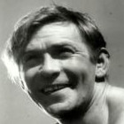

Советский эстрадный артист, певец, исполнитель романсов и джазовых композиций.

* [В землянке](В%20землянке.md)
* [Как много девушек хороших](Как%20много%20девушек%20хороших.md)
* [Песня Извозчика](Песня%20Извозчика.md)
* [Песня старого извозчика](Песня%20старого%20извозчика.md)
* [Тайна](Тайна.md)
* [Шаланды полные кефали](Шаланды%20полные%20кефали.md)