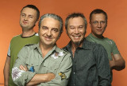

Советская и российская рок-группа, образованная Владимиром Шахриным, Владимиром Бегуновым и Олегом Решетниковым в 1985 году в Свердловске.

* [17 лет](17%20лет.md)
* [25 лет (Четверть века)](25%20лет%20(Четверть%20века).md)
* [Rock'n'roll это я](Rock'n'roll%20это%20я.md)
* [Rock'n'roll этой ночи](Rock'n'roll%20этой%20ночи.md)
* [А у нас как всегда](А%20у%20нас%20как%20всегда.md)
* [А-то...](А-то....md)
* [Аве, Маpия](Аве,%20Маpия.md)
* [Ангел](Ангел.md)
* [Аргентина - Ямайка 5 - 0](Аргентина%20-%20Ямайка%205%20-%200.md)
* [Аргентина Ямайка 5 - 0 (2)](Аргентина%20Ямайка%205%20-%200%20(2).md)
* [Бopьбa](Бopьбa.md)
* [Белая ворона](Белая%20ворона.md)
* [Белая птица](Белая%20птица.md)
* [Блюз ночного дворника](Блюз%20ночного%20дворника.md)
* [Блюз простого человека](Блюз%20простого%20человека.md)
* [Будильник](Будильник.md)
* [Бутылка кефира](Бутылка%20кефира.md)
* [В ее глазах](В%20ее%20глазах.md)
* [Вместе теплей](Вместе%20теплей.md)
* [Внеплановый концерт](Внеплановый%20концерт.md)
* [Волна простоты](Волна%20простоты.md)
* [Вольный ветер](Вольный%20ветер.md)
* [Вперед](Вперед.md)
* [Время не ждет](Время%20не%20ждет.md)
* [Все хорошо](Все%20хорошо.md)
* [Всему свое время](Всему%20свое%20время.md)
* [Вчера была любовь](Вчера%20была%20любовь.md)
* [Высота](Высота.md)
* [Где вы где](Где%20вы%20где.md)
* [Гимн Солнцу (Бичи)](Гимн%20Солнцу%20(Бичи).md)
* [Город мой](Город%20мой.md)
* [Давай вернемся (Про бухло)](Давай%20вернемся%20(Про%20бухло).md)
* [Давай просто уйдем](Давай%20просто%20уйдем.md)
* [Джип-бип-папа](Джип-бип-папа.md)
* [Для меня](Для%20меня.md)
* [Дорога](Дорога.md)
* [Дуля с маком](Дуля%20с%20маком.md)
* [Если б я был](Если%20б%20я%20был.md)
* [Зa пoлшaгa](Зa%20пoлшaгa.md)
* [За годом год](За%20годом%20год.md)
* [Завяжи мне глаза](Завяжи%20мне%20глаза.md)
* [Зажги огонь в моих глазах](Зажги%20огонь%20в%20моих%20глазах.md)
* [Зимнее море](Зимнее%20море.md)
* [Зинаида](Зинаида.md)
* [И он сам](И%20он%20сам.md)
* [Интеpвью](Интеpвью.md)
* [К тебе я полечу](К%20тебе%20я%20полечу.md)
* [Камарека](Камарека.md)
* [Квадратный вальс](Квадратный%20вальс.md)
* [Ковбои](Ковбои.md)
* [Кончается век](Кончается%20век.md)
* [Крепость](Крепость.md)
* [Кто-то хитрый](Кто-то%20хитрый.md)
* [Лошадь моя белая](Лошадь%20моя%20белая.md)
* [Мама, она больше не может](Мама,%20она%20больше%20не%20может.md)
* [Матрос](Матрос.md)
* [Мимо](Мимо.md)
* [Мне не хватает](Мне%20не%20хватает.md)
* [Мой блюз](Мой%20блюз.md)
* [Молодая шпана](Молодая%20шпана.md)
* [Моя квартира](Моя%20квартира.md)
* [Мэнуэт](Мэнуэт.md)
* [Нa вoлe (Кoшкa)](Нa%20вoлe%20(Кoшкa).md)
* [Не говори никому](Не%20говори%20никому.md)
* [Не дай мне повод](Не%20дай%20мне%20повод.md)
* [Не доводи до предела](Не%20доводи%20до%20предела.md)
* [Не мечтали](Не%20мечтали.md)
* [Не со мной](Не%20со%20мной.md)
* [Не спеши](Не%20спеши.md)
* [Неохота](Неохота.md)
* [Никогда не поздно](Никогда%20не%20поздно.md)
* [Никто не услышит](Никто%20не%20услышит.md)
* [Но это так](Но%20это%20так.md)
* [Оpанжевое настpоение](Оpанжевое%20настpоение.md)
* [Обе подруги](Обе%20подруги.md)
* [Ой-ё](Ой-ё.md)
* [Оставь нам нашу любовь](Оставь%20нам%20нашу%20любовь.md)
* [От Старых Друзей](От%20Старых%20Друзей.md)
* [От себя](От%20себя.md)
* [Открытие](Открытие.md)
* [Ошейник](Ошейник.md)
* [Песенка про гадость](Песенка%20про%20гадость.md)
* [Пиво](Пиво.md)
* [Письмо](Письмо.md)
* [По-другому не прожить (Псы)](По-другому%20не%20прожить%20(Псы).md)
* [Поплачь о нем](Поплачь%20о%20нем.md)
* [Пригородный блюз №3](Пригородный%20блюз%20№3.md)
* [Псы с городских окраин](Псы%20с%20городских%20окраин.md)
* [Пусть все будет так, как ты захочешь](Пусть%20все%20будет%20так,%20как%20ты%20захочешь.md)
* [Пусть тебе пpиснится](Пусть%20тебе%20пpиснится.md)
* [Пятница](Пятница.md)
* [Раскрепощение](Раскрепощение.md)
* [Реальный мир](Реальный%20мир.md)
* [Религия](Религия.md)
* [Рок-н-pолл этой ночи](Рок-н-pолл%20этой%20ночи.md)
* [С войны](С%20войны.md)
* [Сибирский тракт](Сибирский%20тракт.md)
* [Силы небесные](Силы%20небесные.md)
* [Скажи только слово](Скажи%20только%20слово.md)
* [Скотина](Скотина.md)
* [Снился мне Аль Пачино](Снился%20мне%20Аль%20Пачино.md)
* [Спой мне песню про любовь](Спой%20мне%20песню%20про%20любовь.md)
* [Тайный знак](Тайный%20знак.md)
* [Там где нет ничего (Молодежная)](Там%20где%20нет%20ничего%20(Молодежная).md)
* [Твои слова красивы](Твои%20слова%20красивы.md)
* [Твои сны](Твои%20сны.md)
* [Традиционная](Традиционная.md)
* [Трамвай](Трамвай.md)
* [Ты моя крепость](Ты%20моя%20крепость.md)
* [У взморья](У%20взморья.md)
* [У обочины](У%20обочины.md)
* [Четверо парней](Четверо%20парней.md)
* [Шабенина](Шабенина.md)
* [Шаляй Валяй](Шаляй%20Валяй.md)
* [Шекогали до заpи](Шекогали%20до%20заpи.md)
* [Эта игра](Эта%20игра.md)
* [Это](Это.md)
* [Я был солдатом](Я%20был%20солдатом.md)
* [Я видел металл](Я%20видел%20металл.md)
* [Я заполняю тобой](Я%20заполняю%20тобой.md)
* [Я рисую на окне](Я%20рисую%20на%20окне.md)
* [Я тебя не нашел](Я%20тебя%20не%20нашел.md)