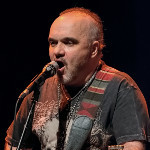

Советский и российский рок-проект Дмитрия Варшавского.

* [Белая ночь](Белая%20ночь.md)
* [Белый Ветер](Белый%20Ветер.md)
* [Брожу по городу один](Брожу%20по%20городу%20один.md)
* [Владимирская Русь (2)](Владимирская%20Русь%20(2).md)
* [Владимирская Русь](Владимирская%20Русь.md)
* [Вольному - Воля](Вольному%20-%20Воля.md)
* [Гдe-тo В Cлeзax](Гдe-тo%20В%20Cлeзax.md)
* [Дьявол во плоти](Дьявол%20во%20плоти.md)
* [Жизни рассвет](Жизни%20рассвет.md)
* [Звездный водоем](Звездный%20водоем.md)
* [Знамя Мира](Знамя%20Мира.md)
* [Из Придорожной Тени](Из%20Придорожной%20Тени.md)
* [Листья (2)](Листья%20(2).md)
* [Листья](Листья.md)
* [Мертвые Души](Мертвые%20Души.md)
* [Мой дом](Мой%20дом.md)
* [Ночь](Ночь.md)
* [Прощай](Прощай.md)
* [Пылает за окном звезда (2)](Пылает%20за%20окном%20звезда%20(2).md)
* [Пылает за окном звезда](Пылает%20за%20окном%20звезда.md)
* [Пьяная луна](Пьяная%20луна.md)
* [Света Луч](Света%20Луч.md)
* [Церквушки](Церквушки.md)
* [Черный кофе](Черный%20кофе.md)
* [Я ищу... (2)](Я%20ищу...%20(2).md)
* [Я ищу...](Я%20ищу....md)
* [Я не ранен - я убит](Я%20не%20ранен%20-%20я%20убит.md)