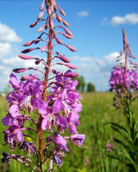

### Иван-чай

Многолетнее растение с цветками фиолетового или бледно-розового цвета.
Используются как противовоспалительное средство и для заваривания "*русского чая*".

 &emsp; 
Названия &emsp; ***Кипрей***, ***Донник***, ***Пырей***.
