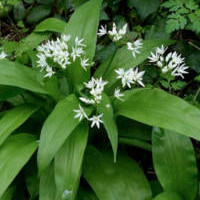

***Черемша***

Многолетнее растение семейства луковых, распространенное в средней полосе России и Европы.
Используется в кулинарии и медицине благодаря *чесночному* вкусу.

 &emsp; 
Названия &emsp; ***Медвежий лук***, ***Колба***.
