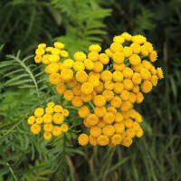

### Пижма

Многолетнее растение семейства астровых, распространенное в средней полосе России,
Америки и Азии. Встречается в городских лесопарках. 
Используется как лекарственное и пряно-ароматическое средство.

 &emsp; 
Названия &emsp; ***Полевая рябинка***, ***Девятильник***.
