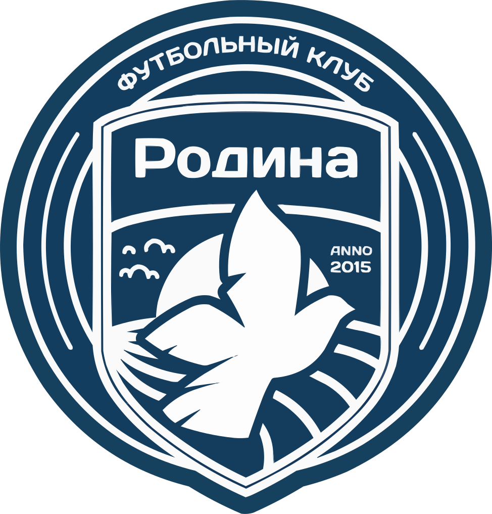
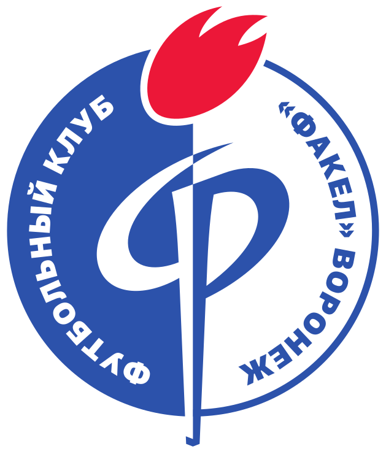
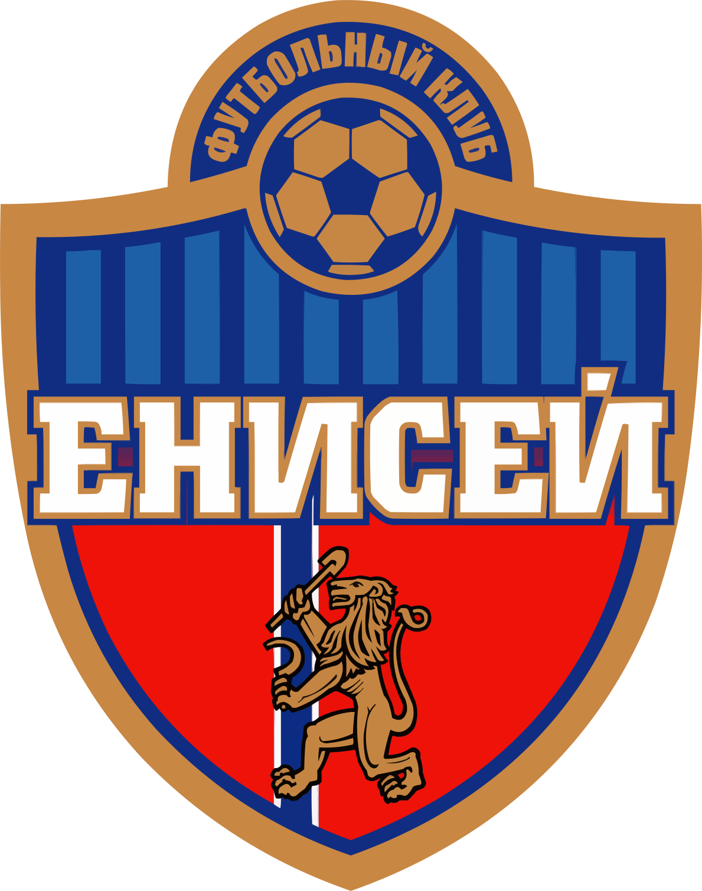

Футбол. Переходные матчи РПЛ.

 
*Пари НН* &nbsp; ***0*** - ***2*** &nbsp;
 
*Родина*

*Факел* &emsp; ***2*** - ***0*** &ensp;

*Енисей*

Поставил *50* руб на *НН* и проиграл... Выиграл *100* руб на *ТМ 3* в матче *Факела*.